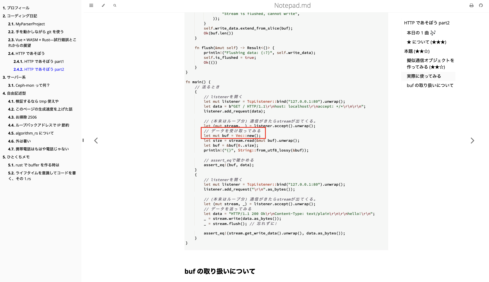

# HTTP であそぼう part2

前回記事を作り込みすぎて後悔しました。
今回からフットワーク軽めで書きたいと思います。

## 本日の 1 曲 🎶

<iframe width="312" height="176" src="https://ext.nicovideo.jp/thumb/sm43424657" scrolling="no" style="border:solid 1px #ccc;" frameborder="0"><a href="https://www.nicovideo.jp/watch/sm43424657">レンズフレア - feat.音楽的同位体(V.I.P)</a></iframe>

同位体 5 人の合唱曲。 かっこよすぎる。

## ★ について (★★★)

★ はこの記事の中でとりあえず読んで欲しいところに 3、自分用のメモレベルで 1 をつけてます。  
なので、★1 の内容が理解できなくても問題ないです! 書いてるやつが悪い。  
一方 ★3 は頑張って書きましたので読んで欲しいな〜

# 本題 (★★☆)

前回、HTTP の構文解析（パース）を行いました。  
これを使えば、受信したデータを HTTP をオブジェクトに直すことができ、データにアクセスが可能です。

とりあえず、これを使って通信を実現してみましょう。

## 擬似通信オブジェクトを作ってみる (★★☆)

擬似通信オブジェクト、つまり通信はしないが通信してるように見せかけるオブジェクトです。  
具体的には Read トレイトと Write トレイトを実装したオブジェクトです。

主な用途は記事やテスト用です。

```rust, ignore
use std::{
    collections::VecDeque,
    io::{Read, Result, Write},
    net::{SocketAddr, ToSocketAddrs},
    thread,
};

#[derive(Debug, Clone, PartialEq, Eq)]
pub struct TcpListener {
    addr: SocketAddr,
    requests: VecDeque<&'static [u8]>,
}

impl TcpListener {
    pub fn bind<A>(addr: A) -> Result<TcpListener>
    where
        A: ToSocketAddrs,
    {
        let addr = addr.to_socket_addrs()?.next().ok_or(std::io::Error::new(
            std::io::ErrorKind::InvalidInput,
            "No address found",
        ))?;

        Ok(TcpListener {
            addr,
            requests: VecDeque::new(),
        })
    }

    pub fn local_addr(&self) -> Result<SocketAddr> {
        Ok(self.addr)
    }

    pub fn add_request(&mut self, request: &'static [u8]) {
        self.requests.push_back(request);
    }

    pub fn accept(&mut self) -> Result<(TcpStream, SocketAddr)> {
        loop {
            if let Some(request) = self.requests.pop_front() {
                let stream = TcpStream {
                    read_data: request,
                    write_data: Vec::new(),
                    is_flushed: false,
                };
                return Ok((stream, self.addr));
            }
            thread::sleep(std::time::Duration::from_millis(100));
        }
    }
}

#[derive(Debug, Clone, PartialEq, Eq)]
pub struct TcpStream<'a> {
    read_data: &'a [u8],
    write_data: Vec<u8>,
    is_flushed: bool,
}

impl TcpStream<'_> {
    pub fn new() -> TcpStream<'static> {
        TcpStream {
            read_data: &[],
            write_data: Vec::new(),
            is_flushed: false,
        }
    }

    pub fn get_write_data(&self) -> Option<&[u8]> {
        if self.is_flushed {
            Some(&self.write_data)
        } else {
            None
        }
    }
}

impl Read for TcpStream<'_> {
    fn read(&mut self, buf: &mut [u8]) -> Result<usize> {
        let bytes = self.read_data;
        let len = bytes.len().min(buf.len());
        buf[..len].copy_from_slice(&bytes[..len]);
        Ok(len)
    }
}

impl Write for TcpStream<'_> {
    fn write(&mut self, buf: &[u8]) -> Result<usize> {
        if self.is_flushed {
            return Err(std::io::Error::new(
                std::io::ErrorKind::WriteZero,
                "Stream is flushed, cannot write",
            ));
        }
        self.write_data.extend_from_slice(buf);
        Ok(buf.len())
    }

    fn flush(&mut self) -> Result<()> {
        println!("Flushing data: {:?}", self.write_data);
        Ok(())
    }
}
```

長大なコードですが、その大半は~~AI 補完~~trait を実装すれば終わります。
内容の説明は至ってシンプルで、標準モジュールに存在する`TcpLisner`と`TcpStream`を最低限レベルで模しただけです。
そのため、`accept()`メソッドで通信を受信、`read()`や`write()`がそのまま使えます。

`accept()`で受信するデータを、キュー方式に対応した Vec `VecDeque` に格納しており、格納手段を提供するために `add_request()` メソッドを追加しております。
これは実際の`TcpLisner`とは異なるメソッドです。
`accept()`は、現実の動作を模すために、キューからデータが消えてもデータを待ち続けます。  
キューにデータが存在しない状態で`accept()`を実行すると、永遠に待つことになりますので注意。

テスト用に`get_write_data()`メソッドを提供してます。 これは`flush()`後でないと`None`を返します！

## 実際に使ってみる

あまりにも内容が薄かったので、流石に善処することとします。 (この記事は一回更新しました。)
実際に動かすとこんな感じです。

(request を来るとき cl -> sv)

```rust,ignore
// listenerを開く
let mut listener = TcpListener::bind("127.0.0.1:80").unwrap();
let data = b"GET / HTTP/1.1\r\nhost: localhost\r\naccept: */*\r\n\r\n";
listener.add_request(data);

// (本来はループ分) 通信がきたらstreamが出てくる。
let (mut stream, _) = listener.accept().unwrap();
// データを受け取ってみる
let mut buf = [0u8;1024];
let size = stream.read(&mut buf).unwrap();
let buf = &buf[0..size];
println!("{}", String::from_utf8_lossy(&buf));

// assert_eqで確かめる
assert_eq!(buf, data);
```

(response 送るとき sv -> cl)

```rust,ignore
// listenerを開く
let mut listener = TcpListener::bind("127.0.0.1:80").unwrap();
listener.add_request("\r\n".as_bytes());

// (本来はループ分) 通信がきたらstreamが出てくる。
let (mut stream, _) = listener.accept().unwrap();
// データを送ってみる
let data = "HTTP/1.1 200 Ok\r\nContent-Type: text/plain\r\n\r\nhello!\r\n";
_ = stream.write(data.as_bytes());
_ = stream.flush(); // 忘れずに!

assert_eq!(stream.get_write_data().unwrap(), data.as_bytes());
```

<details><summary>実際に動作するコード</summary>

```rust,editable
use std::{
    collections::VecDeque,
    io::{Read, Result, Write},
    net::{SocketAddr, ToSocketAddrs},
    thread,
};

#[derive(Debug, Clone, PartialEq, Eq)]
pub struct TcpListener {
    addr: SocketAddr,
    requests: VecDeque<&'static [u8]>,
}

impl TcpListener {
    pub fn bind<A>(addr: A) -> Result<TcpListener>
    where
        A: ToSocketAddrs,
    {
        let addr = addr.to_socket_addrs()?.next().ok_or(std::io::Error::new(
            std::io::ErrorKind::InvalidInput,
            "No address found",
        ))?;

        Ok(TcpListener {
            addr,
            requests: VecDeque::new(),
        })
    }

    pub fn local_addr(&self) -> Result<SocketAddr> {
        Ok(self.addr)
    }

    pub fn add_request(&mut self, request: &'static [u8]) {
        self.requests.push_back(request);
    }

    pub fn accept(&mut self) -> Result<(TcpStream, SocketAddr)> {
        loop {
            if let Some(request) = self.requests.pop_front() {
                let stream = TcpStream {
                    read_data: request,
                    write_data: Vec::new(),
                    is_flushed: false,
                };
                return Ok((stream, self.addr));
            }
            thread::sleep(std::time::Duration::from_millis(100));
        }
    }
}

#[derive(Debug, Clone, PartialEq, Eq)]
pub struct TcpStream<'a> {
    read_data: &'a [u8],
    write_data: Vec<u8>,
    is_flushed: bool,
}

impl TcpStream<'_> {
    pub fn new() -> TcpStream<'static> {
        TcpStream {
            read_data: &[],
            write_data: Vec::new(),
            is_flushed: false,
        }
    }

    pub fn get_write_data(&self) -> Option<&[u8]> {
        if self.is_flushed {
            Some(&self.write_data)
        } else {
            None
        }
    }
}

impl Read for TcpStream<'_> {
    fn read(&mut self, buf: &mut [u8]) -> Result<usize> {
        let bytes = self.read_data;
        let len = bytes.len().min(buf.len());
        buf[..len].copy_from_slice(&bytes[..len]);
        Ok(len)
    }
}

impl Write for TcpStream<'_> {
    fn write(&mut self, buf: &[u8]) -> Result<usize> {
        if self.is_flushed {
            return Err(std::io::Error::new(
                std::io::ErrorKind::WriteZero,
                "Stream is flushed, cannot write",
            ));
        }
        self.write_data.extend_from_slice(buf);
        Ok(buf.len())
    }

    fn flush(&mut self) -> Result<()> {
        println!("Flushing data: {:?}", self.write_data);
        Ok(())
    }
}

fn main() {
    // 送るとき
    {
        // listenerを開く
        let mut listener = TcpListener::bind("127.0.0.1:80").unwrap();
        let data = b"GET / HTTP/1.1\r\nhost: localhost\r\naccept: */*\r\n\r\n";
        listener.add_request(data);

        // (本来はループ分) 通信がきたらstreamが出てくる。
        let (mut stream, _) = listener.accept().unwrap();
        // データを受け取ってみる
        let mut buf = [0u8;1024];
        let size = stream.read(&mut buf).unwrap();
        let buf = &buf[0..size];
        println!("{}", String::from_utf8_lossy(&buf));

        // assert_eqで確かめる
        assert_eq!(buf, data);
    }
    {
        // listenerを開く
        let mut listener = TcpListener::bind("127.0.0.1:80").unwrap();
        listener.add_request("\r\n".as_bytes());

        // (本来はループ分) 通信がきたらstreamが出てくる。
        let (mut stream, _) = listener.accept().unwrap();
        // データを送ってみる
        let data = "HTTP/1.1 200 Ok\r\nContent-Type: text/plain\r\n\r\nhello!\r\n";
        _ = stream.write(data.as_bytes());
        _ = stream.flush(); // 忘れずに!

        assert_eq!(stream.get_write_data().unwrap(), data.as_bytes());
    }
}

```

</details>

## buf の取り扱いについて

少し前に buf の取り扱いで注意するべき内容を載せた記事を書きましたが、おさらい。

- スタック上におくの
- 0 埋めしておく

```rust
let buf = [0u8; 10];
```

その記事は[こちら](../../../ひとくちメモ/rustでbufferを作る時は)

なお、この擬似 buffer を使っても当然、その問題は起きるので注意です！

```rust,ignore
// (本来はループ分) 通信がきたらstreamが出てくる。
let (mut stream, _) = listener.accept().unwrap();
// データを受け取ってみる
let mut buf = Vec::new(); // 動作しない！
let size = stream.read(&mut buf).unwrap();
let buf = &buf[0..size];
println!("{}", String::from_utf8_lossy(&buf));
```

> [!TIP]
> 上の「実際に動作するコード」は編集できるので、  
> 試してみてください！
> 

## まとめ

擬似的に再現可能な TCPListener と TCPSocket を作った。 テストなどで応用が効きそうだ。  
最近可不ェインが不足していることがわかった。

## ご意見募集中

[当サイトのリポジトリ](https://github.com/tam1192/notepad.md/issues)にて、issue 募集中です!

- 投稿には github アカウントが必要です。
- テンプレート用意してます。 ぜひ活用してください。
  - [感想用テンプレート](https://github.com/tam1192/tam1192/issues/new?template=感想-コメント.md)
  - [誤解を招く内容への指摘](https://github.com/tam1192/tam1192/issues/new?template=誤解を招く内容への指摘.md)

# 作ったコードを置いてます

[github](https://github.com/tam1192/experiments-http-server.rs)にて作ってきたコードをまとめたものを置いてます。  
よかったら参考に...できるかな
