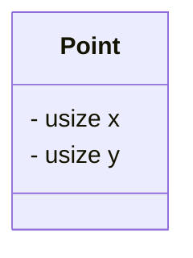
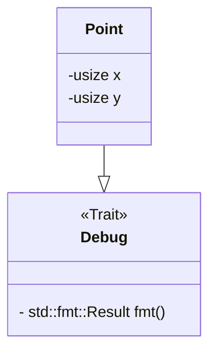
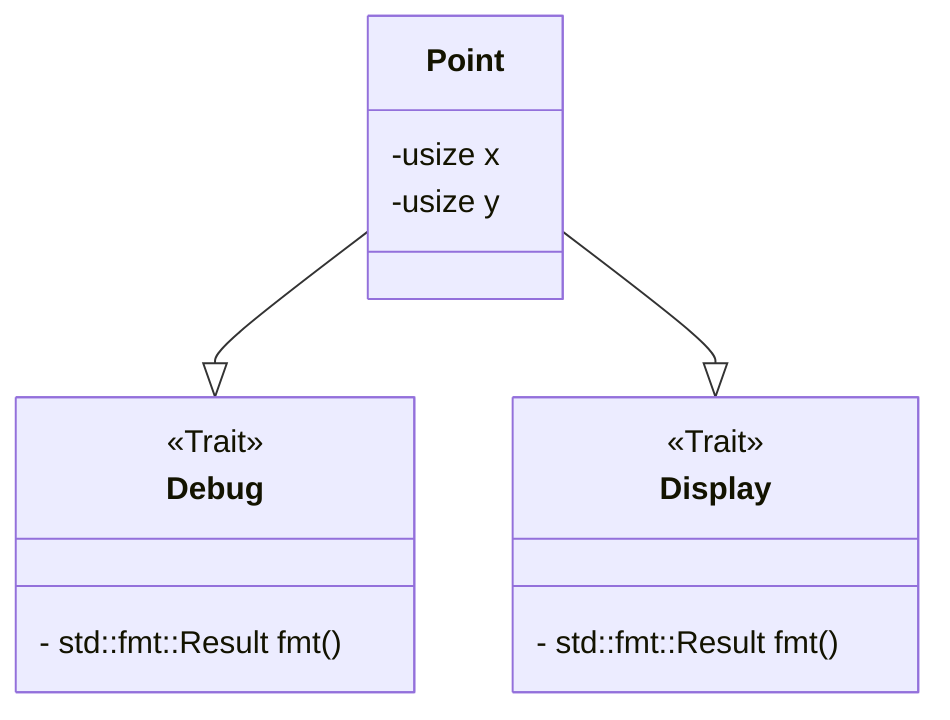

# 構造体で遊ぶ

この記事を書いた理由って必要ですか。  
特に構造体推しでもないし、ネタ切れではあるけど、少しまとめとこと思っただけで理由って必要ですか。

(オリ曲のサビから抽出)

# 本日の一本

曲ストックが切れたので、次は動画でも共有しようかと思った。

<iframe width="312" height="176" src="https://ext.nicovideo.jp/thumb/sm44622995" scrolling="no" style="border:solid 1px #ccc;" frameborder="0"><a href="https://www.nicovideo.jp/watch/sm44622995">死神とロバ</a></iframe>

これ本当草  
~~(twitter の引用 RT かよ)~~

# まず普通に定義する



この UML の通りに構造体を定義してみます

```rust, compile_fail
struct Point {
    x: usize,
    y: usize,
}
fn main() {
    let p = Point { x: 3, y: 6 };
    println!("{}", p);
}
```

実行すりゃ破るけど、これだと普通にエラーになるわけで。  
こいつは**表示機能を持ってない**からね。もしくは、println で表示する免許を持ってない。  
Point 構造体に(とりあえず)`Debug`トレイトを実装しよう。

> [!NOTE]
> これを書いている頃の日記さんは、trait を免許とたとえてもいいんじゃないかという~~困った~~どうでもいい考えを持ってます。

> [!TIP]  
> 実行すれば、コンパイルエラーと表示されるはずです。 (`error: could not compile...`)  
> コンパイルエラーは実行ファイルが作られないで発生するエラーです。 よって、コンパイルエラーが含まれているコードからは**プログラムが発生しない**。  
> コンパイルエラーは安全なのです。 一方、**実行時に発生するエラーは安全ではないエラーです。**
>
> rust の安全性の一つは、コンパイルエラーが豊富なことだと感じます。(あくまで感想)  
> エラーが含まれるコードは、コンパイルの時点で弾いてくれるのでね。

## Debug を定義する



多分こんな感じ

```rust
#[derive(Debug)]
struct Point {
    x: usize,
    y: usize,
}
fn main() {
    let p = Point { x: 3, y: 6 };
    println!("{:?}", p);
}
```

derive マクロによってほぼ自動的に実装してもらいました。
`println!`の中身で、`{}`が`{:?}`に変わっていることに注意が必要です。

> [!TIP]  
> `#[]`は**手続きマクロ**と呼ばれるものですね。
> [この記事](https://qiita.com/namn1125/items/06e65d1313ca50a1eb5d)が詳しいと思います。  
> 一方て、`println!()`と関数名の後ろに`!`がついているのは**宣言マクロ**です。  
> 可変長引数に対応する関数が作れます。

> [!NOTE]  
> せっかくなので出力例を、おっと。  
> この mdbook というやつは**コードブロックそのまま実行可能だったんだ。** ▶️ ボタンで実行可能。

## 文字列変換に対応させ、好きなフォーマットで出力できるようにする



```rust
use std::fmt;

#[derive(Debug)]
struct Point {
    x: usize,
    y: usize,
}

impl fmt::Display for Point {
    fn fmt(&self, f: &mut fmt::Formatter<'_>) -> fmt::Result {
        write!(f, "{}, {}", self.x, self.y)
    }
}

fn main() {
    let p = Point { x: 3, y: 6 };
    println!("{}", p);
    assert_eq!(p.to_string(), String::from("3, 6"));
}
```

Debug と異なり、Display はフォーマットを自分で作りたいので手動です。  
Display は`to_string()`も間接的に実装してくれます ToString トレイトもありますが、Display を使っておけば両方に対応するのです。  
`write!`マクロは println と使い心地が似てますが、先頭に Formatter を指定する必要があります。

# まとめ

オリ曲の存在を証明するには、私の頭を解剖するしかない。
