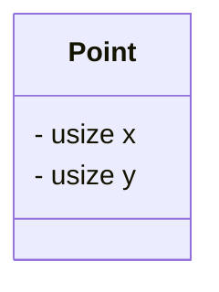
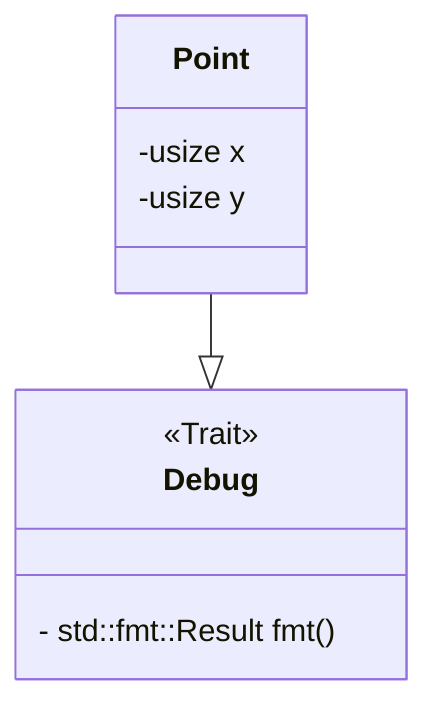
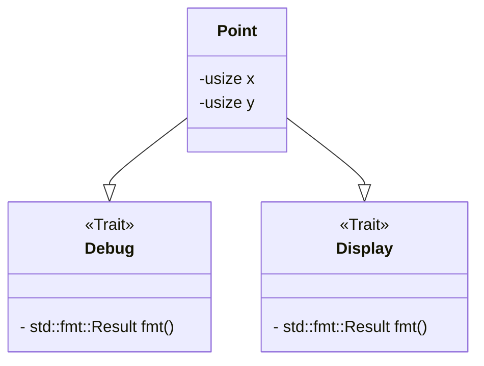
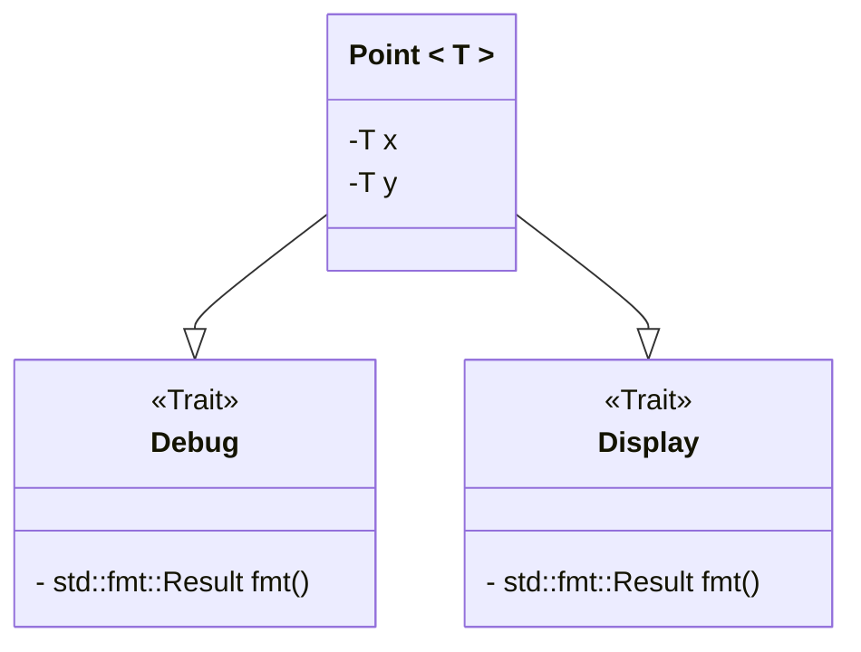

# 構造体で遊ぶ

この記事を書いた理由って必要ですか。  
特に構造体推しでもないし、ネタ切れではあるけど、少しまとめとこと思っただけで理由って必要ですか。

(オリ曲のサビから抽出)

# 本日の一本

曲ストックが切れたので、次は動画でも共有しようかと思った。

<iframe width="312" height="176" src="https://ext.nicovideo.jp/thumb/sm44622995" scrolling="no" style="border:solid 1px #ccc;" frameborder="0"><a href="https://www.nicovideo.jp/watch/sm44622995">死神とロバ</a></iframe>

これ本当草  
~~(twitter の引用 RT かよ)~~

# まず普通に定義する



この UML の通りに構造体を定義してみます

```rust, compile_fail
struct Point {
    x: usize,
    y: usize,
}
fn main() {
    let p = Point { x: 3, y: 6 };
    println!("{}", p);
}
```

実行すりゃ破るけど、これだと普通にエラーになるわけで。  
こいつは**表示機能を持ってない**からね。もしくは、println で表示する免許を持ってない。  
Point 構造体に(とりあえず)`Debug`トレイトを実装しよう。

> [!NOTE]
> これを書いている頃の日記さんは、trait を免許とたとえてもいいんじゃないかという~~困った~~どうでもいい考えを持ってます。

> [!TIP]  
> 実行すれば、コンパイルエラーと表示されるはずです。 (`error: could not compile...`)  
> コンパイルエラーは実行ファイルが作られないで発生するエラーです。 よって、コンパイルエラーが含まれているコードからは**プログラムが発生しない**。  
> コンパイルエラーは安全なのです。 一方、**実行時に発生するエラーは安全ではないエラーです。**
>
> rust の安全性の一つは、コンパイルエラーが豊富なことだと感じます。(あくまで感想)  
> エラーが含まれるコードは、コンパイルの時点で弾いてくれるのでね。

## Debug を定義する



多分こんな感じ

```rust
#[derive(Debug)]
struct Point {
    x: usize,
    y: usize,
}
fn main() {
    let p = Point { x: 3, y: 6 };
    println!("{:?}", p);
}
```

derive マクロによってほぼ自動的に実装してもらいました。
`println!`の中身で、`{}`が`{:?}`に変わっていることに注意が必要です。

> [!TIP]  
> `#[]`は**手続きマクロ**と呼ばれるものですね。
> [この記事](https://qiita.com/namn1125/items/06e65d1313ca50a1eb5d)が詳しいと思います。  
> 一方て、`println!()`と関数名の後ろに`!`がついているのは**宣言マクロ**です。  
> 可変長引数に対応する関数が作れます。

> [!NOTE]  
> せっかくなので出力例を、おっと。  
> この mdbook というやつは**コードブロックそのまま実行可能だったんだ。** ▶️ ボタンで実行可能。

## 文字列変換に対応させ、好きなフォーマットで出力できるようにする



```rust
use std::fmt;

#[derive(Debug)]
struct Point {
    x: usize,
    y: usize,
}

impl fmt::Display for Point {
    fn fmt(&self, f: &mut fmt::Formatter<'_>) -> fmt::Result {
        write!(f, "{}, {}", self.x, self.y)
    }
}

fn main() {
    let p = Point { x: 3, y: 6 };
    println!("{}", p);
    assert_eq!(p.to_string(), String::from("3, 6"));
}
```

Debug と異なり、Display はフォーマットを自分で作りたいので手動です。  
Display は`to_string()`も間接的に実装してくれます ToString トレイトもありますが、Display を使っておけば両方に対応するのです。  
`write!`マクロは println と使い心地が似てますが、先頭に Formatter を指定する必要があります。

# ユーザーに自由な値を提供する

`usize`以外にも、`u8`でメモリを節約する、`i32`でプラマイに対応する、`f64`で小数点に対応させる、`&str`で文字列を扱うようにするなど、さまざまなユースケースが考えられます。



```rust
use std::fmt;

#[derive(Debug)]
struct Point<T> {
    x: T,
    y: T,
}

impl<T> fmt::Display for Point<T> {
    fn fmt(&self, f: &mut fmt::Formatter<'_>) -> fmt::Result {
        write!(f, "{}, {}", self.x, self.y)
    }
}

fn main() {
    let p = Point { x: 3, y: 6 };
    println!("{}", p);
    assert_eq!(p.to_string(), String::from("3, 6"));
}
```

残念ながらこれでは、コンパイルエラーになります。  
問題点は「Display」です。 **T が Display(もしくは ToString)を実装しているという確証がないのです。**

## T が特定のトレイトを実装している時のみ、メソッドの利用を許容する

rust のトレイトは、面白い機能があります。 **メンバー変数が実装しているトレイトによって、使用できるメソッドを変化させられるのです!**

```rust
use std::fmt;

#[derive(Debug)]
struct Point<T> {
    x: T,
    y: T,
}

impl<T> fmt::Display for Point<T>
where
    T: fmt::Display,
{
    fn fmt(&self, f: &mut fmt::Formatter<'_>) -> fmt::Result {
        write!(f, "{}, {}", self.x, self.y)
    }
}

fn main() {
    let p = Point { x: 3, y: 6 };
    println!("{}", p);
    assert_eq!(p.to_string(), String::from("3, 6"));
}
```

構造体`Point`は、型に制限なく作ることができます。 **Display トレイトを実装してなくても、実装できます。**  
一方で、Point を Display に対応させるためには、**型 T に Display トレイトを実装している必要があります。**

## 足し算引き算できるようにする。

数学的なのはおいといて、x と y それぞれ足し引きできるようにします。 `Add`トレイト、および`Sub`トレイトです。

```rust
use std::{
    fmt,
    ops::{Add, Sub},
};

#[derive(Debug)]
struct Point<T> {
    x: T,
    y: T,
}
#
# impl<T> fmt::Display for Point<T>
# where
#     T: fmt::Display,
# {
#     fn fmt(&self, f: &mut fmt::Formatter<'_>) -> fmt::Result {
#         write!(f, "{}, {}", self.x, self.y)
#     }
# }

impl<T> Add for Point<T>
where
    T: Add<Output = T>,
{
    type Output = Point<T>;
    fn add(self, rhs: Self) -> Self::Output {
        let x = self.x + rhs.x;
        let y = self.y + rhs.y;
        Self { x, y }
    }
}

impl<T> Sub for Point<T>
where
    T: Sub<Output = T>,
{
    type Output = Point<T>;

    fn sub(self, rhs: Self) -> Self::Output {
        let x = self.x - rhs.x;
        let y = self.y - rhs.y;
        Self { x, y }
    }
}

fn main() {
    let p = Point { x: 3, y: 6 };
    println!("{}", p);
    assert_eq!(p.to_string(), String::from("3, 6"));
}
```

type は型に**別名を与える**という役割を持ってます。型に名前をつけると、コメント以上に可読性が上がります。  
**オリジナルな型のように見えます**。 構造体、enum の仲間みたいな。見えるだけでなく、可視性もそんな感じになったはず。

```rust, ignore
/// 戻り値は、kg単位で返却されます
fn latest_weight(id: usize) -> i32;
/// 戻り値は、cm単位で返却されます
fn latest_length(id: usize) -> i32;
```

```rust, ignore
type Kg = i32;
type Cm = i32;

fn latest_weight(id: usize) -> Kg;
fn latest_length(id: usize) -> Cm;
```

もう一つは、トレイト定義の自由度を高める使い方があります。  
`Add`、`Sub`などの計算系トレイトの戻り値は、Output(出力)の方を**自由に調整できます。**

```rust, ignore
impl<T> Sub for Point<T>
where
    T: Sub<Output = T>,
{
    type Output = Point<T>;
#}
```

型 T 自体にも、**T を Output とする Sub トレイトを実装**している必要があり、  
自信も`Point<T>`を Output とする Sub トレイトを実装しています。

# まとめ

オリ曲の存在を証明するには、私の頭を解剖するしかない。
