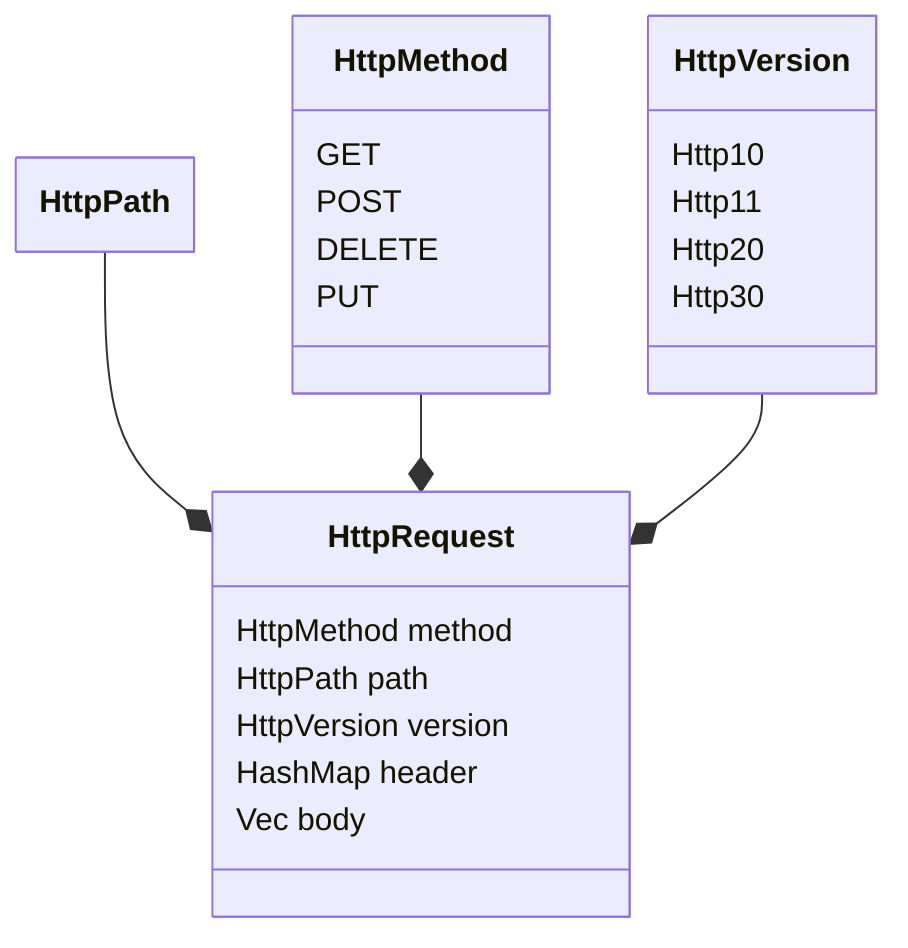

# HTTP であそぼう part1

作業しながら備忘録として書いてるので、基本内容は適当、思いつきです。
参考にしないでね。

## とりあえずサッと書いてみた。

```rust
#use std::{
#    collections::HashMap,
#    fmt::Display,
#    io::{Read, Write},
#    net::{IpAddr, SocketAddr, TcpListener},
#    sync::{Arc, Mutex, mpsc::channel},
#    thread,
#};

#mod route;
fn main() {
    let listener = TcpListener::bind("0.0.0.0:80").unwrap();
    loop {
        if let Ok(data) = listener.accept() {
            let (stream, addr) = data;
            let mut stream = stream;

            // read data
            let (buf, _) = {
                let mut buf = [0u8; 1024];
                match stream.read(&mut buf) {
                    Ok(size) => (buf, size),
                    Err(err) => {
                        eprintln!("{}", err);
                        return;
                    }
                }
            };

            let data = String::from_utf8_lossy(&buf);
            let mut lines = data.lines();

            let (method, path, _) = {
                // GET / HTTP/1.1
                let line = lines.next().unwrap(); // first Line
                let mut parts = line.split_whitespace();
                // parse method
                let method = HttpMethod::from(parts.next().unwrap_or(""));
                // parse path
                let path = HttpPath::from(parts.next().unwrap_or(""));
                // parse version
                let version = parts.next().unwrap_or("");
                (method, path, version)
            };

            let headers = {
                let mut header = HashMap::<&str, &str>::new();
                // parse headers

                loop {
                    if let Some(line) = lines.next() {
                        let mut parts =
                            line.split(':').map(|s| s.trim()).filter(|s| !s.is_empty());

                        let key = match parts.next() {
                            Some(k) => k,
                            None => break, // no more headers
                        };

                        let value = match parts.next() {
                            Some(v) => v,
                            None => break, // no more headers
                        };

                        if parts.next() != None {
                            break;
                        }

                        header.insert(key, value);
                    } else {
                        break;
                    }
                }

                header
            };

            let _ = stream.flush();
        }
    }
}

#[derive(Debug, Clone, PartialEq, Eq)]
enum HttpMethod {
    Get,
    Post,
    Put,
    Delete,
}
impl Display for HttpMethod {
    fn fmt(&self, f: &mut std::fmt::Formatter<'_>) -> std::fmt::Result {
        match self {
            HttpMethod::Get => write!(f, "GET"),
            HttpMethod::Post => write!(f, "POST"),
            HttpMethod::Put => write!(f, "PUT"),
            HttpMethod::Delete => write!(f, "DELETE"),
        }
    }
}
impl HttpMethod {
    fn from_str(s: &str) -> Option<Self> {
        match s.to_lowercase().as_str() {
            "get" => Some(HttpMethod::Get),
            "post" => Some(HttpMethod::Post),
            "put" => Some(HttpMethod::Put),
            "delete" => Some(HttpMethod::Delete),
            _ => None,
        }
    }
}
impl From<&str> for HttpMethod {
    fn from(s: &str) -> Self {
        HttpMethod::from_str(s).unwrap_or(HttpMethod::Get)
    }
}

#[derive(Debug, Clone, PartialEq, Eq)]
struct HttpPath<'a>(&'a str);

impl<'a> HttpPath<'a> {
    fn from_str(s: &'a str) -> Option<Self> {
        let mut c = s.chars();
        // Check if the first character is a slash
        if c.next() != Some('/') {
            return None;
        }

        // 許可文字以外を検知したらNoneを返す
        // findの戻り値=Noneなら許可文字のみ
        if c.find(|c| !(c.is_ascii_alphanumeric() || *c == '/' || *c == '-' || *c == '_')) == None {
            Some(HttpPath(s))
        } else {
            None
        }
    }
}

impl<'a> From<&'a str> for HttpPath<'a> {
    fn from(s: &'a str) -> Self {
        HttpPath::from_str(s).unwrap_or(HttpPath("/"))
    }
}
```

書いてて思ったのですが、~~AI ってすげぇや~~AI 保管ウゼェ！！  
いや、ほんとこれ大量に処理リソース食う=お金かかるのにこれいうのはまじで申し訳ないんですが、慣れるまでの間は大変です。

自分が想定している以上のコードまで書いてくれて、私が置いてきぼりになる。  
機長置いていかないでもろて... ~~アンチアイスオフにしないでよね~~

とはいえ普通に便利です。

## HTTP ヘッダーの形について

nc コマンドで取得してみると...

```sh
nc -l 80
```

```sh
curl http://localhost/
```

この結果(nc 側に表示される)は次のとおり

```http
GET / HTTP/1.1
Host: localhost
User-Agent: curl/8.7.1
Accept: */*
```

一方、MDN などで調べると返信はこんな感じになります。

```http
HTTP/1.1 200 Ok
Content-Type: text/html; charset: utf-8;

<!DOCTYPE html>
<html>
    <head>
        <title>hello world</title>
    </head>
    <body>
        <h1>hello world</h1>
    </body>
</html>
```

これを撃ち返してやれば

**hello world**

というサイトが表示されるでしょう

ちなみに、nc は出力以外にも**入力に対応**しているので、リクエスト(GET / HTTP/1.1)と届いたら、それを返すだけでページを返せます。
(全て書き終わったら、^c もしくは^d で nc を一度終了させたら行きます。 いかない場合もあるかも。)

## HTTP ヘッダー関係を構造体にしてしまおう

上記コードを少し変えて、しっかり構造体にしちましょう。



この形にするのが無難かな？

### path

Path は[関連 RFC](https://datatracker.ietf.org/doc/html/rfc3986#section-2.3)によると

```
unreserved  = ALPHA / DIGIT / "-" / "." / "_" / "~"
```

が使えるらしいです。 ALPHA は a-z と A-Z、DIGIT は 0-9 です。
つまり、new 時点でこの文字でしか作れないように制約をつけましょう。

```rust
# use std::fmt;

#[derive(Debug, Clone, PartialEq, Eq)]
struct HttpPath<'a>(&'a str);

impl<'a> HttpPath<'a> {
    // 許可された文字列のみで作る
    fn from_str(s: &'a str) -> Option<Self> {
        // 文字単位に分解します
        let mut c = s.chars();

        // 先頭は/になると見込んで
        if c.next() != Some('/') {
            return None;
        }

        // findメソッドで許可されていない文字があるか検索しましょう
        // なかったら成功です。
        if c.find(|c| {
            // a-zA-Z0-9/\-_以外を探す
            !(c.is_ascii_alphanumeric() || *c == '/' || *c == '-' || *c == '_')
        }) == None {
            Some(HttpPath(s))
        } else {
            None
        }
    }
}

// Fromトレイトもつけて、文字列から簡単に変換できるようにしましょう
impl<'a> From<&'a str> for HttpPath<'a> {
    fn from(s: &'a str) -> Self {
        HttpPath::from_str(s).unwrap_or(HttpPath("/")) // デフォルト値は /
    }
}

// 文字列で取得できるように、Displayを実装しておきましょう
impl<'a> fmt::Display for HttpPath<'a> {
    fn fmt(&self, f: &mut fmt::Formatter<'_>) -> fmt::Result {
        write!(f, "{}", self.0)
    }
}

# fn main() {
// 検証してみよう
assert_eq!(HttpPath::from("/").to_string(), "/".to_string());
assert_eq!(HttpPath::from("/aaa/bbb/ccc").to_string(), "/aaa/bbb/ccc".to_string());
assert_eq!(HttpPath::from("").to_string(), "/".to_string());
assert_eq!(HttpPath::from("こんにちは！").to_string(), "/".to_string());
# println!("all success! 成功!");
# }
```

コード的には**最初の難関**。 文字に分解して find で not 検索を行うからね。  
頭捻らないと出てこない。日記さんは他のところでパーサーやってたので感覚的にはわかるけど。

### method

調べるのがめんどかったので、主要四つにしましょう。

```
GET
POST
DELETE
PUT
```

これを扱える enum を作れば良いです。 文字列でも生成可能にしましょう。

```rust
# use std::fmt;
#
#[derive(Debug, Clone, PartialEq, Eq)]
enum HttpMethod {
    Get,
    Post,
    Put,
    Delete,
}
impl HttpMethod {
    fn from_str(s: &str) -> Option<Self> {
        // 大文字/小文字を考慮しない。(小文字に統一)
        match s.to_lowercase().as_str() {
            "get" => Some(HttpMethod::Get),
            "post" => Some(HttpMethod::Post),
            "put" => Some(HttpMethod::Put),
            "delete" => Some(HttpMethod::Delete),
            _ => None,
        }
    }
}
impl From<&str> for HttpMethod {
    fn from(s: &str) -> Self {
        HttpMethod::from_str(s).unwrap_or(HttpMethod::Get)
    }
}
// 文字列で取得できるように、Displayを実装しておきましょう
impl fmt::Display for HttpMethod {
    fn fmt(&self, f: &mut fmt::Formatter<'_>) -> fmt::Result {
        write!(f, "{}", match self {
            Self::Get => "GET",
            Self::Post => "POST",
            Self::Put => "PUT",
            Self::Delete => "DELETE",
        })
    }
}

# fn main() {
// 検証してみよう
assert_eq!(HttpMethod::from("get").to_string(), "GET".to_string());
assert_eq!(HttpMethod::from("post"), HttpMethod::Post);
assert_eq!(HttpMethod::from("put"), HttpMethod::Put);
assert_eq!(HttpMethod::from("delete"), HttpMethod::Delete);
assert_eq!(HttpMethod::from(""), HttpMethod::Get);
# println!("all success! 成功!");
# }
```

### version

簡易的に作る時は無視するところですね。  
これも基本的には enum で ok。 TLS/SSL と違って更新頻度が低いので、`1.0, 1.1, 2.0, 3.0` があれば ok です。
(1.0 もいらないかも。)

```rust
#use std::fmt;
#
#[derive(Debug, Clone, PartialEq, Eq)]
enum HttpVersion {
    Http10,
    Http11,
    Http20,
    Http30,
}
impl HttpVersion {
    fn from_str(s: &str) -> Option<Self> {
        // 大文字/小文字を考慮しない。(小文字に統一)
        match s.to_lowercase().as_str() {
            "http/1.0" => Some(HttpVersion::Http10),
            "http/1.1" => Some(HttpVersion::Http11),
            "http/2.0" => Some(HttpVersion::Http20),
            "http/3.0" => Some(HttpVersion::Http30),
            _ => None,
        }
    }
}
impl From<&str> for HttpVersion  {
    fn from(s: &str) -> Self {
        HttpVersion::from_str(s).unwrap_or(HttpVersion::Http10)
    }
}
// 文字列で取得できるように、Displayを実装しておきましょう
impl fmt::Display for HttpVersion {
    fn fmt(&self, f: &mut fmt::Formatter<'_>) -> fmt::Result {
        write!(f, "{}", match self {
            Self::Http10 => "HTTP/1.0",
            Self::Http11 => "HTTP/1.1",
            Self::Http20 => "HTTP/2.0",
            Self::Http30 => "HTTP/3.0",
        })
    }
}

# fn main() {
// 検証してみよう
assert_eq!(HttpVersion::from("Http/1.0").to_string(), "HTTP/1.0".to_string());
assert_eq!(HttpVersion::from("http/1.1"), HttpVersion::Http11);
assert_eq!(HttpVersion::from("HTTP/2.0"), HttpVersion::Http20);
assert_eq!(HttpVersion::from("HTTP/3.0"), HttpVersion::Http30);
assert_eq!(HttpVersion::from(""), HttpVersion::Http10);
# println!("all success! 成功!");
# }
```

...つかバージョンは変更対応しんどいだけやし文字列でええやろと思った。  
ちなみにこの記事は**実況記事**です。 この先コメントなどによってはコード計画が変わる可能性があります。

### header

一番しんどいところです。 特に使う部分(Content-Type や Accept、Host など)は別の関数から、簡易的にアクセスできるようにしていいと思います。
KeyValue 方式なので、それに従い HashMap を活用しましょう。
とりあえず 1 行をパースして hashmap に追加するところまで作ってみよう。

ちなみに、header と body の間には 1 行の空白行があります。 これは上手く使えそうですね! 私は上手く使えてるかわからんけど。

```rust
fn line_parse_http_header(s: &str) -> Option<(&str, &str)> {
    // 1行取得する。
    let line = s.lines().next()?;
    // :で分けて、無駄なスペースの排除。
    let mut parts = line.split(':').map(|s| s.trim()).filter(|s| !s.is_empty());

    // 2個取って1個目をkey、2個目をvalueと仮定する。 一つでもかけたらheaderじゃないと考える
    let key = parts.next()?;
    let value = parts.next()?;

    // 3個目があったらheaderじゃないと考える
    if parts.next() != None {
        return None;
    }

    Some((key, value))
}

# fn main() {
assert_eq!(
    line_parse_http_header("Content-Type: text/plain"),
    Some(("Content-Type", "text/plain")));
assert_eq!(
    line_parse_http_header("Content-Type:"),
    None);
assert_eq!(
    line_parse_http_header("Content-Type: Content-Type: text/plain"),
    None);
assert_eq!(
    line_parse_http_header("Content-Type: "),
    None);
assert_eq!(
    line_parse_http_header("   "),
    None);
assert_eq!(
    line_parse_http_header("<html><head><title>hello</title></head><body></body></html>"),
    None);
assert_eq!(
    line_parse_http_header("<html><head><title>:</title></head><body></body></html>"),
    Some(("<html><head><title>", "</title></head><body></body></html>")));


# println!("all success! 成功!");
# println!("");
# println!("補足");
# println!("最後のコードではHtmlがそのままHeaderとしてパースされている");
# println!("残念ながら、この実装でも、そのデータが完璧にHeaderである保証はできない。");
# println!("しかし、正規的なHTTPパケットであればheadとbodyの間に1行の隙間がある。");
# println!("これを使い、とりあえずhtmlコードがパースされる心配はないようにする");
# }
```

当然ながら header は 1 行だけではないので、複数行に対応しましょう。

```rust
use std::collections::HashMap;

#fn line_parse_http_header(s: &str) -> Option<(&str, &str)> {
#    // 1行取得する。
#    let line = s.lines().next()?;
#    // :で分けて、無駄なスペースの排除。
#    let mut parts = line.split(':').map(|s| s.trim()).filter(|s| !s.is_empty());
#
#    // 2個取って1個目をkey、2個目をvalueと仮定する。 一つでもかけたらheaderじゃないと考える
#    let key = parts.next()?;
#    let value = parts.next()?;
#
#    // 3個目があったらheaderじゃないと考える
#    if parts.next() != None {
#        return None;
#    }
#
#    Some((key, value))
#}
#
fn main() {
    // 行ごとに処理するイテレーターを取得
    let buf = "Content-Type: plain/html \r\nHost: localhost\r\n\r\n<!DOCTYPE html>\r\n";
    let mut lines = buf.lines();
    let mut data: HashMap<&str, &str> = HashMap::new();

    loop {
        let line = lines.next().unwrap_or("");
        match line_parse_http_header(line) {
            Some((k, v)) => {
                _ = data.insert(k, v);
                },
            None => break,
        }
    }

    println!("{:?}", data);
}
```

### 結合してみる

これだけでよし

```rust
# use std::{collections::HashMap, fmt};
#
# #[derive(Debug, Clone, PartialEq, Eq)]
#struct HttpPath<'a>(&'a str);
#
#impl<'a> HttpPath<'a> {
#    // 許可された文字列のみで作る
#    fn from_str(s: &'a str) -> Option<Self> {
#        // 文字単位に分解します
#        let mut c = s.chars();
#
#        // 先頭は/になると見込んで
#        if c.next() != Some('/') {
#            return None;
#        }
#
#        // findメソッドで許可されていない文字があるか検索しましょう
#        // なかったら成功です。
#        if c.find(|c| {
#            // a-zA-Z0-9/\-_以外を探す
#            !(c.is_ascii_alphanumeric() || *c == '/' || *c == '-' || *c == '_')
#        }) == None {
#            Some(HttpPath(s))
#        } else {
#            None
#        }
#    }
#}
#
#// Fromトレイトもつけて、文字列から簡単に変換できるようにしましょう
#impl<'a> From<&'a str> for HttpPath<'a> {
#    fn from(s: &'a str) -> Self {
#        HttpPath::from_str(s).unwrap_or(HttpPath("/")) // デフォルト値は /
#    }
#}
#// 文字列で取得できるように、Displayを実装しておきましょう
#impl<'a> fmt::Display for HttpPath<'a> {
#    fn fmt(&self, f: &mut fmt::Formatter<'_>) -> fmt::Result {
#        write!(f, "{}", self.0)
#    }
#}
# #[derive(Debug, Clone, PartialEq, Eq)]
#enum HttpMethod {
#    Get,
#    Post,
#    Put,
#    Delete,
#}
#impl HttpMethod {
#    fn from_str(s: &str) -> Option<Self> {
#        // 大文字/小文字を考慮しない。(小文字に統一)
#        match s.to_lowercase().as_str() {
#            "get" => Some(HttpMethod::Get),
#            "post" => Some(HttpMethod::Post),
#            "put" => Some(HttpMethod::Put),
#            "delete" => Some(HttpMethod::Delete),
#            _ => None,
#        }
#    }
#}
#impl From<&str> for HttpMethod {
#    fn from(s: &str) -> Self {
#        HttpMethod::from_str(s).unwrap_or(HttpMethod::Get)
#    }
#}
#// 文字列で取得できるように、Displayを実装しておきましょう
#impl fmt::Display for HttpMethod {
#    fn fmt(&self, f: &mut fmt::Formatter<'_>) -> fmt::Result {
#        write!(f, "{}", match self {
#            Self::Get => "GET",
#            Self::Post => "POST",
#            Self::Put => "PUT",
#            Self::Delete => "DELETE",
#        })
#    }
# }
# #[derive(Debug, Clone, PartialEq, Eq)]
#enum HttpVersion {
#    Http10,
#    Http11,
#    Http20,
#    Http30,
#}
#impl HttpVersion {
#    fn from_str(s: &str) -> Option<Self> {
#        // 大文字/小文字を考慮しない。(小文字に統一)
#        match s.to_lowercase().as_str() {
#            "http/1.0" => Some(HttpVersion::Http10),
#            "http/1.1" => Some(HttpVersion::Http11),
#            "http/2.0" => Some(HttpVersion::Http20),
#            "http/3.0" => Some(HttpVersion::Http30),
#            _ => None,
#        }
#    }
#}
#impl From<&str> for HttpVersion  {
#    fn from(s: &str) -> Self {
#        HttpVersion::from_str(s).unwrap_or(HttpVersion::Http10)
#    }
#}
#// 文字列で取得できるように、Displayを実装しておきましょう
#impl fmt::Display for HttpVersion {
#    fn fmt(&self, f: &mut fmt::Formatter<'_>) -> fmt::Result {
#        write!(f, "{}", match self {
#            Self::Http10 => "HTTP/1.0",
#            Self::Http11 => "HTTP/1.1",
#            Self::Http20 => "HTTP/2.0",
#            Self::Http30 => "HTTP/3.0",
#        })
#    }
#}
#
#fn line_parse_http_header(s: &str) -> Option<(&str, &str)> {
#    // 1行取得する。
#    let line = s.lines().next()?;
#    // :で分けて、無駄なスペースの排除。
#    let mut parts = line.split(':').map(|s| s.trim()).filter(|s| !s.is_empty());
#
#    // 2個取って1個目をkey、2個目をvalueと仮定する。 一つでもかけたらheaderじゃないと考える
#    let key = parts.next()?;
#    let value = parts.next()?;
#
#    // 3個目があったらheaderじゃないと考える
#    if parts.next() != None {
#        return None;
#    }
#
#    Some((key, value))
#}
#
#
#[derive(Debug, Clone, PartialEq, Eq)]
struct HttpRequest<'a> {
    method: HttpMethod,
    path: HttpPath<'a>,
    version: HttpVersion,
    header: HashMap<&'a str, &'a str>,
    body: String,
}
impl<'a> HttpRequest<'a> {
    fn from_str(s: &'a str) -> Option<Self> {
        // 行取得で行う
        let mut lines = s.lines();

        // 1行目を取得する
        let mut parts = {
            let line = lines.next().unwrap_or("");
            line.split_whitespace() // スペース単位で分割させる
        };
        let method = HttpMethod::from(parts.next().unwrap_or(""));
        let path = HttpPath::from(parts.next().unwrap_or(""));
        let version = HttpVersion::from(parts.next().unwrap_or(""));
        // 余分にあったら無効とする
        if parts.next() != None {
            return None;
        }

        // 2行目(以降)を処理する
        let mut header: HashMap<&str, &str> = HashMap::new();
        loop {
            let line = lines.next().unwrap_or("");
            match line_parse_http_header(line) {
                Some((k, v)) => {
                    _ = header.insert(k, v);
                    },
                None => break,
            }
        }

        // headerの処理をする
        let body = lines.collect::<String>();

        Some (HttpRequest{
            method,
            path,
            version,
            header,
            body
        })
    }
}
// 文字列で取得できるように、Displayを実装しておきましょう
impl<'a> fmt::Display for HttpRequest<'a> {
    fn fmt(&self, f: &mut fmt::Formatter<'_>) -> fmt::Result {
        write!(f, "{} {} {}\r\n", self.method, self.method, self.version)?;
        for (k, v) in &self.header {
            write!(f, "{}: {}\r\n", k, v)?;
        }
        write!(f, "\r\n{}", self.body)
    }
}

#[derive(Debug, Clone, PartialEq, Eq)]
struct HttpResponse<'a> {
    version: HttpVersion,
    status: (u32, &'a str), // レスポンスは番号とメッセージで返す
    header: HashMap<&'a str, &'a str>,
    body: String,
}

// 文字列で取得できるように、Displayを実装しておきましょう
impl<'a> fmt::Display for HttpResponse<'a> {
    fn fmt(&self, f: &mut fmt::Formatter<'_>) -> fmt::Result {
        write!(f, "{} {} {}\r\n", self.version, self.status.0, self.status.1)?;
        for (k, v) in &self.header {
            write!(f, "{}: {}\r\n", k, v)?;
        }
        write!(f, "\r\n{}", self.body)
    }
}
```

HttpRequest と HttpResponse の

### 次回

次回は、これらを使ってシングルスレッドサーバーを作ってみようと思います。
