# HTTP であそぼう part1 (★★☆)

作業しながら備忘録として書いてるので、基本内容は適当、思いつきです。
参考にしないでね。

## 本日の 1 曲 🎶

自分がこの記事を書いた時代がわかるように、これから本日の一曲という項目を書いていきます。唐突に追加しました。
今最も聞いてる曲で選曲してます。

[ガラスハナビ / ねじ式 feat.小春六花](https://www.nicovideo.jp/watch/sm42571626)  
PV の立花ちゃんがかわいいね。

## ★ について (★★★)

★ はこの記事の中でとりあえず読んで欲しいところに 3、自分用のメモレベルで 1 をつけてます。  
なので、★1 の内容が理解できなくても問題ないです! 書いてるやつが悪い。  
一方 ★3 は頑張って書きましたので読んで欲しいな〜

# 本題 (★★★)

## とりあえずサッと書いてみた。 (★☆☆)

```rust, ignore
#use std::{
#    collections::HashMap,
#    fmt::Display,
#    io::{Read, Write},
#    net::{IpAddr, SocketAddr, TcpListener},
#    sync::{Arc, Mutex, mpsc::channel},
#    thread,
#};

#mod route;
fn main() {
    let listener = TcpListener::bind("0.0.0.0:80").unwrap();
    loop {
        if let Ok(data) = listener.accept() {
            let (stream, addr) = data;
            let mut stream = stream;

            // read data
            let (buf, _) = {
                let mut buf = [0u8; 1024];
                match stream.read(&mut buf) {
                    Ok(size) => (buf, size),
                    Err(err) => {
                        eprintln!("{}", err);
                        return;
                    }
                }
            };

            let data = String::from_utf8_lossy(&buf);
            let mut lines = data.lines();

            let (method, path, _) = {
                // GET / HTTP/1.1
                let line = lines.next().unwrap(); // first Line
                let mut parts = line.split_whitespace();
                // parse method
                let method = HttpMethod::from(parts.next().unwrap_or(""));
                // parse path
                let path = HttpPath::from(parts.next().unwrap_or(""));
                // parse version
                let version = parts.next().unwrap_or("");
                (method, path, version)
            };

            let headers = {
                let mut header = HashMap::<&str, &str>::new();
                // parse headers

                loop {
                    if let Some(line) = lines.next() {
                        let mut parts =
                            line.split(':').map(|s| s.trim()).filter(|s| !s.is_empty());

                        let key = match parts.next() {
                            Some(k) => k,
                            None => break, // no more headers
                        };

                        let value = match parts.next() {
                            Some(v) => v,
                            None => break, // no more headers
                        };

                        if parts.next() != None {
                            break;
                        }

                        header.insert(key, value);
                    } else {
                        break;
                    }
                }

                header
            };

            let _ = stream.flush();
        }
    }
}

#[derive(Debug, Clone, PartialEq, Eq)]
enum HttpMethod {
    Get,
    Post,
    Put,
    Delete,
}
impl Display for HttpMethod {
    fn fmt(&self, f: &mut std::fmt::Formatter<'_>) -> std::fmt::Result {
        match self {
            HttpMethod::Get => write!(f, "GET"),
            HttpMethod::Post => write!(f, "POST"),
            HttpMethod::Put => write!(f, "PUT"),
            HttpMethod::Delete => write!(f, "DELETE"),
        }
    }
}
impl HttpMethod {
    fn from_str(s: &str) -> Option<Self> {
        match s.to_lowercase().as_str() {
            "get" => Some(HttpMethod::Get),
            "post" => Some(HttpMethod::Post),
            "put" => Some(HttpMethod::Put),
            "delete" => Some(HttpMethod::Delete),
            _ => None,
        }
    }
}
impl From<&str> for HttpMethod {
    fn from(s: &str) -> Self {
        HttpMethod::from_str(s).unwrap_or(HttpMethod::Get)
    }
}

#[derive(Debug, Clone, PartialEq, Eq)]
struct HttpPath<'a>(&'a str);

impl<'a> HttpPath<'a> {
    fn from_str(s: &'a str) -> Option<Self> {
        let mut c = s.chars();
        // Check if the first character is a slash
        if c.next() != Some('/') {
            return None;
        }

        // 許可文字以外を検知したらNoneを返す
        // findの戻り値=Noneなら許可文字のみ
        if c.find(|c| !(c.is_ascii_alphanumeric() || *c == '/' || *c == '-' || *c == '_')) == None {
            Some(HttpPath(s))
        } else {
            None
        }
    }
}

impl<'a> From<&'a str> for HttpPath<'a> {
    fn from(s: &'a str) -> Self {
        HttpPath::from_str(s).unwrap_or(HttpPath("/"))
    }
}
```

書いてて思ったのですが、~~AI ってすげぇや~~AI 保管ウゼェ！！  
いや、ほんとこれ大量に処理リソース食う=お金かかるのにこれいうのはまじで申し訳ないんですが、慣れるまでの間は大変です。

自分が想定している以上のコードまで書いてくれて、私が置いてきぼりになる。  
機長置いていかないでもろて... ~~アンチアイスオフにしないでよね~~

とはいえ普通に便利です。

> [!WARNING]
> このコード深夜テンションで一気に書いてしかも動作テストしてないクソコードなので期待しないでください

## HTTP ヘッダーの形について　(★★★)

nc コマンドで取得してみると...

```sh
nc -l 80
```

```sh
curl http://localhost/
```

この結果(nc 側に表示される)は次のとおり

```http
GET / HTTP/1.1
Host: localhost
User-Agent: curl/8.7.1
Accept: */*
```

一方、MDN などで調べると返信はこんな感じになります。

```http
HTTP/1.1 200 Ok
Content-Type: text/html; charset: utf-8;

<!DOCTYPE html>
<html>
    <head>
        <title>hello world</title>
    </head>
    <body>
        <h1>hello world</h1>
    </body>
</html>
```

これを撃ち返してやれば

**hello world**

というサイトが表示されるでしょう

ちなみに、nc は出力以外にも**入力に対応**しているので、リクエスト(GET / HTTP/1.1)と届いたら、それを返すだけでページを返せます。

> [!NOTE]
> 全て書き終わったら、^c もしくは^d で nc を一度終了させて、送信させます。 いかない場合もあるかも。

## HTTP ヘッダー関係を構造体にしてしまおう　(★★☆)

上記コードを少し変えて、しっかり構造体にしちましょう。


この形にするのが無難かな？

### path

Path は[関連 RFC](https://datatracker.ietf.org/doc/html/rfc3986#section-2.3)によると

```
unreserved  = ALPHA / DIGIT / "-" / "." / "_" / "~"
```

が使えるらしいです。 ALPHA は a-z と A-Z、DIGIT は 0-9 です。
つまり、new 時点でこの文字でしか作れないように制約をつけましょう。

```rust
# use std::fmt;

#[derive(Debug, Clone, PartialEq, Eq)]
struct HttpPath<'a>(&'a str);

impl<'a> HttpPath<'a> {
    // 許可された文字列のみで作る
    fn from_str(s: &'a str) -> Option<Self> {
        // 文字単位に分解します
        let mut c = s.chars();

        // 先頭は/になると見込んで
        if c.next() != Some('/') {
            return None;
        }

        // findメソッドで許可されていない文字があるか検索しましょう
        // なかったら成功です。
        if c.find(|c| {
            // a-zA-Z0-9/\-_以外を探す
            !(c.is_ascii_alphanumeric() || *c == '/' || *c == '-' || *c == '_')
        }) == None {
            Some(HttpPath(s))
        } else {
            None
        }
    }
}

// Fromトレイトもつけて、文字列から簡単に変換できるようにしましょう
impl<'a> From<&'a str> for HttpPath<'a> {
    fn from(s: &'a str) -> Self {
        HttpPath::from_str(s).unwrap_or(HttpPath("/")) // デフォルト値は /
    }
}

// 文字列で取得できるように、Displayを実装しておきましょう
impl<'a> fmt::Display for HttpPath<'a> {
    fn fmt(&self, f: &mut fmt::Formatter<'_>) -> fmt::Result {
        write!(f, "{}", self.0)
    }
}

# fn main() {
// 検証してみよう
assert_eq!(HttpPath::from("/").to_string(), "/".to_string());
assert_eq!(HttpPath::from("/aaa/bbb/ccc").to_string(), "/aaa/bbb/ccc".to_string());
assert_eq!(HttpPath::from("").to_string(), "/".to_string());
assert_eq!(HttpPath::from("こんにちは！").to_string(), "/".to_string());
# println!("all success! 成功!");
# }
```

コード的には**最初の難関**。 文字に分解して find で not 検索を行うからね。  
頭捻らないと出てこない。日記さんは他のところでパーサーやってたので感覚的にはわかるけど。

### method

調べるのがめんどかったので、主要四つにしましょう。

```
GET
POST
DELETE
PUT
```

これを扱える enum を作れば良いです。 文字列でも生成可能にしましょう。

```rust
# use std::fmt;
#
#[derive(Debug, Clone, PartialEq, Eq)]
enum HttpMethod {
    Get,
    Post,
    Put,
    Delete,
}
impl HttpMethod {
    fn from_str(s: &str) -> Option<Self> {
        // 大文字/小文字を考慮しない。(小文字に統一)
        match s.to_lowercase().as_str() {
            "get" => Some(HttpMethod::Get),
            "post" => Some(HttpMethod::Post),
            "put" => Some(HttpMethod::Put),
            "delete" => Some(HttpMethod::Delete),
            _ => None,
        }
    }
}
impl From<&str> for HttpMethod {
    fn from(s: &str) -> Self {
        HttpMethod::from_str(s).unwrap_or(HttpMethod::Get)
    }
}
// 文字列で取得できるように、Displayを実装しておきましょう
impl fmt::Display for HttpMethod {
    fn fmt(&self, f: &mut fmt::Formatter<'_>) -> fmt::Result {
        write!(f, "{}", match self {
            Self::Get => "GET",
            Self::Post => "POST",
            Self::Put => "PUT",
            Self::Delete => "DELETE",
        })
    }
}

# fn main() {
// 検証してみよう
assert_eq!(HttpMethod::from("get").to_string(), "GET".to_string());
assert_eq!(HttpMethod::from("post"), HttpMethod::Post);
assert_eq!(HttpMethod::from("put"), HttpMethod::Put);
assert_eq!(HttpMethod::from("delete"), HttpMethod::Delete);
assert_eq!(HttpMethod::from(""), HttpMethod::Get);
# println!("all success! 成功!");
# }
```

### version

簡易的に作る時は無視するところですね。  
これも基本的には enum で ok。 TLS/SSL と違って更新頻度が低いので、`1.0, 1.1, 2.0, 3.0` があれば ok です。
(1.0 もいらないかも。)

```rust
#use std::fmt;
#
#[derive(Debug, Clone, PartialEq, Eq)]
enum HttpVersion {
    Http10,
    Http11,
    Http20,
    Http30,
}
impl HttpVersion {
    fn from_str(s: &str) -> Option<Self> {
        // 大文字/小文字を考慮しない。(小文字に統一)
        match s.to_lowercase().as_str() {
            "http/1.0" => Some(HttpVersion::Http10),
            "http/1.1" => Some(HttpVersion::Http11),
            "http/2.0" => Some(HttpVersion::Http20),
            "http/3.0" => Some(HttpVersion::Http30),
            _ => None,
        }
    }
}
impl From<&str> for HttpVersion  {
    fn from(s: &str) -> Self {
        HttpVersion::from_str(s).unwrap_or(HttpVersion::Http10)
    }
}
// 文字列で取得できるように、Displayを実装しておきましょう
impl fmt::Display for HttpVersion {
    fn fmt(&self, f: &mut fmt::Formatter<'_>) -> fmt::Result {
        write!(f, "{}", match self {
            Self::Http10 => "HTTP/1.0",
            Self::Http11 => "HTTP/1.1",
            Self::Http20 => "HTTP/2.0",
            Self::Http30 => "HTTP/3.0",
        })
    }
}

# fn main() {
// 検証してみよう
assert_eq!(HttpVersion::from("Http/1.0").to_string(), "HTTP/1.0".to_string());
assert_eq!(HttpVersion::from("http/1.1"), HttpVersion::Http11);
assert_eq!(HttpVersion::from("HTTP/2.0"), HttpVersion::Http20);
assert_eq!(HttpVersion::from("HTTP/3.0"), HttpVersion::Http30);
assert_eq!(HttpVersion::from(""), HttpVersion::Http10);
# println!("all success! 成功!");
# }
```

...つかバージョンは変更対応しんどいだけやし文字列でええやろと思った。  
ちなみにこの記事は**実況記事**です。 この先コメントなどによってはコード計画が変わる可能性があります。

### header

一番しんどいところです。 特に使う部分(Content-Type や Accept、Host など)は別の関数から、簡易的にアクセスできるようにしていいと思います。
KeyValue 方式なので、それに従い HashMap を活用しましょう。
とりあえず 1 行をパースして hashmap に追加するところまで作ってみよう。

ちなみに、header と body の間には 1 行の空白行があります。 これは上手く使えそうですね! 私は上手く使えてるかわからんけど。

```rust
fn line_parse_http_header(s: &str) -> Option<(&str, &str)> {
    // 最初の:を探す
    let i = s.find(':')?;

    Some((&s[0..i], &s[i+1..].trim())) // :でk/vを切り分けて終わり
}

# fn main() {
assert_eq!(
    line_parse_http_header("Content-Type: text/plain"),
    Some(("Content-Type", "text/plain")));
assert_eq!(
    line_parse_http_header("Content-Type:"),
    Some(("Content-Type", "")));
assert_eq!(
    line_parse_http_header("Content-Type: Content-Type: text/plain"),
    Some(("Content-Type", "Content-Type: text/plain")));
assert_eq!(
    line_parse_http_header("Content-Type: "),
    Some(("Content-Type", "")));
assert_eq!(
    line_parse_http_header("   "),
    None);
assert_eq!(
    line_parse_http_header("<html><head><title>hello</title></head><body></body></html>"),
    None);
assert_eq!(
    line_parse_http_header("<html><head><title>:</title></head><body></body></html>"),
    Some(("<html><head><title>", "</title></head><body></body></html>")));


# println!("all success! 成功!");
# println!("");
# println!("補足");
# println!("最後のコードではHtmlがそのままHeaderとしてパースされている");
# println!("残念ながら、この実装でも、そのデータが完璧にHeaderである保証はできない。");
# println!("しかし、正規的なHTTPパケットであればheadとbodyの間に1行の隙間がある。");
# println!("これを使い、とりあえずhtmlコードがパースされる心配はないようにする");
# }
```

当然ながら header は 1 行だけではないので、複数行に対応しましょう。

```rust
use std::collections::HashMap;

#fn line_parse_http_header(s: &str) -> Option<(&str, &str)> {
#    // 最初の:を探す
#    let i = s.find(':')?;
#
#    Some((&s[0..i], &s[i+1..].trim())) // :でk/vを切り分けて終わり
#}
#
fn main() {
    // 行ごとに処理するイテレーターを取得
    let buf = "Content-Type: plain/html \r\nHost: localhost\r\n\r\n<!DOCTYPE html>\r\n";
    let mut lines = buf.lines();
    let mut data: HashMap<&str, &str> = HashMap::new();

    loop {
        let line = lines.next().unwrap_or("");
        match line_parse_http_header(line) {
            Some((k, v)) => {
                _ = data.insert(k, v);
                },
            None => break,
        }
    }

    println!("{:?}", data);
}
```

### 結合してみる

これだけでよし

```rust
# use std::{collections::HashMap, fmt};
#
# #[derive(Debug, Clone, PartialEq, Eq)]
#struct HttpPath<'a>(&'a str);
#
#impl<'a> HttpPath<'a> {
#    // 許可された文字列のみで作る
#    fn from_str(s: &'a str) -> Option<Self> {
#        // 文字単位に分解します
#        let mut c = s.chars();
#
#        // 先頭は/になると見込んで
#        if c.next() != Some('/') {
#            return None;
#        }
#
#        // findメソッドで許可されていない文字があるか検索しましょう
#        // なかったら成功です。
#        if c.find(|c| {
#            // a-zA-Z0-9/\-_以外を探す
#            !(c.is_ascii_alphanumeric() || *c == '/' || *c == '-' || *c == '_')
#        }) == None {
#            Some(HttpPath(s))
#        } else {
#            None
#        }
#    }
#}
#
#// Fromトレイトもつけて、文字列から簡単に変換できるようにしましょう
#impl<'a> From<&'a str> for HttpPath<'a> {
#    fn from(s: &'a str) -> Self {
#        HttpPath::from_str(s).unwrap_or(HttpPath("/")) // デフォルト値は /
#    }
#}
#// 文字列で取得できるように、Displayを実装しておきましょう
#impl<'a> fmt::Display for HttpPath<'a> {
#    fn fmt(&self, f: &mut fmt::Formatter<'_>) -> fmt::Result {
#        write!(f, "{}", self.0)
#    }
#}
# #[derive(Debug, Clone, PartialEq, Eq)]
#enum HttpMethod {
#    Get,
#    Post,
#    Put,
#    Delete,
#}
#impl HttpMethod {
#    fn from_str(s: &str) -> Option<Self> {
#        // 大文字/小文字を考慮しない。(小文字に統一)
#        match s.to_lowercase().as_str() {
#            "get" => Some(HttpMethod::Get),
#            "post" => Some(HttpMethod::Post),
#            "put" => Some(HttpMethod::Put),
#            "delete" => Some(HttpMethod::Delete),
#            _ => None,
#        }
#    }
#}
#impl From<&str> for HttpMethod {
#    fn from(s: &str) -> Self {
#        HttpMethod::from_str(s).unwrap_or(HttpMethod::Get)
#    }
#}
#// 文字列で取得できるように、Displayを実装しておきましょう
#impl fmt::Display for HttpMethod {
#    fn fmt(&self, f: &mut fmt::Formatter<'_>) -> fmt::Result {
#        write!(f, "{}", match self {
#            Self::Get => "GET",
#            Self::Post => "POST",
#            Self::Put => "PUT",
#            Self::Delete => "DELETE",
#        })
#    }
# }
# #[derive(Debug, Clone, PartialEq, Eq)]
#enum HttpVersion {
#    Http10,
#    Http11,
#    Http20,
#    Http30,
#}
#impl HttpVersion {
#    fn from_str(s: &str) -> Option<Self> {
#        // 大文字/小文字を考慮しない。(小文字に統一)
#        match s.to_lowercase().as_str() {
#            "http/1.0" => Some(HttpVersion::Http10),
#            "http/1.1" => Some(HttpVersion::Http11),
#            "http/2.0" => Some(HttpVersion::Http20),
#            "http/3.0" => Some(HttpVersion::Http30),
#            _ => None,
#        }
#    }
#}
#impl From<&str> for HttpVersion  {
#    fn from(s: &str) -> Self {
#        HttpVersion::from_str(s).unwrap_or(HttpVersion::Http10)
#    }
#}
#// 文字列で取得できるように、Displayを実装しておきましょう
#impl fmt::Display for HttpVersion {
#    fn fmt(&self, f: &mut fmt::Formatter<'_>) -> fmt::Result {
#        write!(f, "{}", match self {
#            Self::Http10 => "HTTP/1.0",
#            Self::Http11 => "HTTP/1.1",
#            Self::Http20 => "HTTP/2.0",
#            Self::Http30 => "HTTP/3.0",
#        })
#    }
#}
#
#fn line_parse_http_header(s: &str) -> Option<(&str, &str)> {
#    // 最初の:を探す
#    let i = s.find(':')?;
#
#    Some((&s[0..i], &s[i+1..].trim())) // :でk/vを切り分けて終わり
#}
#
#
#[derive(Debug, Clone, PartialEq, Eq)]
struct HttpRequest<'a> {
    method: HttpMethod,
    path: HttpPath<'a>,
    version: HttpVersion,
    header: HashMap<&'a str, &'a str>,
    body: String,
}
impl<'a> HttpRequest<'a> {
    fn from_str(s: &'a str) -> Option<Self> {
        // 行取得で行う
        let mut lines = s.lines();

        // 1行目を取得する
        let mut parts = {
            let line = lines.next().unwrap_or("");
            line.split_whitespace() // スペース単位で分割させる
        };
        let method = HttpMethod::from(parts.next().unwrap_or(""));
        let path = HttpPath::from(parts.next().unwrap_or(""));
        let version = HttpVersion::from(parts.next().unwrap_or(""));
        // 余分にあったら無効とする
        if parts.next().is_some() {
            return None;
        }

        // 2行目(以降)を処理する
        let mut header: HashMap<&str, &str> = HashMap::new();
        loop {
            let line = lines.next().unwrap_or("");
            match line_parse_http_header(line) {
                Some((k, v)) => {
                    _ = header.insert(k, v);
                    },
                None => break,
            }
        }

        // headerの処理をする
        let body = lines.collect::<String>();

        Some (HttpRequest{
            method,
            path,
            version,
            header,
            body
        })
    }
}
// 文字列で取得できるように、Displayを実装しておきましょう
impl<'a> fmt::Display for HttpRequest<'a> {
    fn fmt(&self, f: &mut fmt::Formatter<'_>) -> fmt::Result {
        write!(f, "{} {} {}\r\n", self.method, self.path, self.version)?;
        for (k, v) in &self.header {
            write!(f, "{}: {}\r\n", k, v)?;
        }
        write!(f, "\r\n{}", self.body)
    }
}

#[derive(Debug, Clone, PartialEq, Eq)]
struct HttpResponse<'a> {
    version: HttpVersion,
    status: (u32, &'a str), // レスポンスは番号とメッセージで返す
    header: HashMap<&'a str, &'a str>,
    body: String,
}

// 文字列で取得できるように、Displayを実装しておきましょう
impl<'a> fmt::Display for HttpResponse<'a> {
    fn fmt(&self, f: &mut fmt::Formatter<'_>) -> fmt::Result {
        write!(f, "{} {} {}\r\n", self.version, self.status.0, self.status.1)?;
        for (k, v) in &self.header {
            write!(f, "{}: {}\r\n", k, v)?;
        }
        write!(f, "\r\n{}", self.body)
    }
}

fn main() {
    let packet = "GET / HTTP/1.1\r\nHost: localhost\r\nAccept: */*\r\n\r\n";
    let request = HttpRequest::from_str(&packet).unwrap();
    println!("{}", request);
}

```

HttpRequest と HttpResponse の構造体を定義、うち Request は文字列からの生成と出力に対応させた。

# パースの知識 (★★★)

今回文字列のパースがメインだったため、パースの知識を書いておきます。

## lines()と split()と chars()　(★★☆)

文字列メソッドであるこれらの関数について、簡単にまとめておきましょう。  
まず、いずれもこれらの関数はイテレーターを返します。 イテレーターは、オブジェクト指向で頻繁に出てくるデザインパターンの一つです。  
内容は至ってシンプル。 `Iter`トレイトをつけて`next()`メソッドを実装できれば OK です。

```mermaid
---
config:
  class:
    hideEmptyMembersBox: true
---
classDiagram
direction TB
    class Iter {
	    next()
    }
    class ExampleClass {
	    Index
	    next()
    }

	<<Interface>> Iter
    note for ExampleClass "試しに実装してみる構造体です"

    ExampleClass ..|> Iter
```



```rust
struct ExampleClass {
    index: u64,
    max: u64, // 上限を決めておく
}

impl Iterator for ExampleClass {
    type Item = u64;

    // 76個ぐらいメソッドあるけど、これだけ実装しておけばOK!
    fn next(&mut self) -> Option<Self::Item> {
        let res = self.index;
        if res > self.max {
            return None;
        }
        self.index += 1; // 次のためにindexをずらしておく
        Some(res)
    }
}

fn main() {
    let ec = ExampleClass{index: 0, max: 10};
    for i in ec {
        println!("{}", i);
    }
}
```

この例は実質 Range を作ってます。

`next()`が実装できれば残りの 75 個ができると書いてありますが...
結局`next()`で解決するので実装は不要です。
(`find`は next を繰り返しながら条件一致を探す。 `filter`は next を繰り返しながら条件に一致するものだけを収集する。)

> [!NOTE]
> rust のイテレーターについては、~~死ぬほどお世話になってます~~この記事がおすすめです。  
> [Rust のイテレータの網羅的かつ大雑把な紹介](https://qiita.com/lo48576/items/34887794c146042aebf1)

## index か、文字か(★★★)

前の項目でイテレーターの紹介をし、さりげなく`find()`というメソッドの紹介をしました。  
改めて、`find()`は項目を探す関数なのですが... **イテレーターと文字列(str, String)に、同名のメソッドが存在してる!!!**  
ややこしいですね。 しかも両方とも、しょっちゅう使います。  
**`chars()`にして`find()`にすることもあれば、文字列のまま`find()`で検索、文字の index を探すこともあります**

```rust, ignore
let base = "hello";

let index = 3; // インデックス
let object = 'l'; // 文字
```

ここで重要なのは、 **index を得るか、文字の存在を得るか、** です

- index を得る(文字列の`find()`を使う)  
  例えば`:`のような区切り文字を取得するときに使用できます。  
  `:`の前後で分割するという使い方できます。
  **戻り値は数値(`Option<usize>`)です！**
- 文字の存在を得る(イテレーターの`find()`を使う)  
  例えば、許可文字以外の文字を検知し、弾くというときに使用できます。  
  **戻り値は文字(`Option<char>`)です!**

どちらの find も、**基本的には左側から探します。** そして、 **一番最初に見つけたものを返します。**

> [!TIP]
> イテレーターの場合、`rev()`によって逆順(右側から)にすることも可、文字列の場合は`rfind`メソッドで対応可能

```rust
fn main() {
    {
        let base = "33-4";
        let index = base.find('-').unwrap_or(0);

        assert_eq!((&base[0..index], &base[index+1..]),("33","4"));
        # println!("33-4 を 33と4に分解できました");
    }
    {
        let base = "33-4";
        let res = base.chars().find(|c| c.is_ascii_control()).is_none();

        assert!(res);
        # println!("33-4 にascii制御文字はありません");
        # println!("(※ascii制御文字: 改行文字(\\n)とか、ターミナルでよく入力するであろう^c(Ctrl+c)こと)");
    }
}
```

## filter vs find (★★☆)

これは主にイテレーターで使うものです。 filter は許容文字以外を消すことができます。  
しかし、許容文字以外を許可しない、**バリデーションを行う**用途には向いていないと日記さんは考えます。

というのも、送り主の許可なく解釈を変えるのはよくないからです。  
よく、人とやりとりするとき、言葉の意味を都合よく解釈することがあるのですが、とてもよくありません。  
検索して言葉の意味を調べることができますが、**相手が意味を誤用していたり、方言的な意味で一般とは異なることもあります。**
なので、わからない場合は素直に聞き返した方が楽ではあります。 (~~...まぁ、すぐに ggrks と言われるからできないんだけどさ~~)

ということで、相手の入力に誤りがある場合、素直に`None`など、パースに失敗したことを伝えた方がいいのです。

**ではフィルターをどこで使えばいいのでしょうか？**

```rust
fn main() {
    let base = "    helloworld";
    // スペースを排除する
    let res = base.chars().filter(|c| !c.is_ascii_whitespace()).collect::<String>();
    println!("{}", res);
    # println!("");
    # println!("このように、バリデーションではなく、余分な部分を排除するなどの用途に向いてます！");
}
```

> [!TIP]
> 先頭と最後のスペースを排除するなら文字列のメソッド`trim()`がおすすめです。 `trim_start()` と `trim_end()` もあります！

## まとめと次回 (☆☆☆)

今回は文字列の処理を行いました。

次回は、これらを使ってシングルスレッドサーバーを作ってみようと思います。
