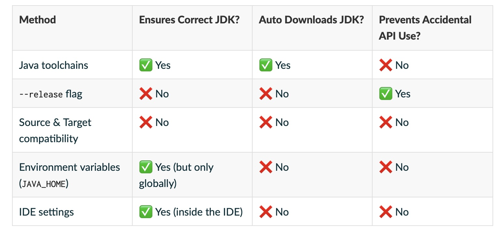

# 基礎編 part1

地味に gradle について理解を深める必要があるため、それを先にやってしまいたいと思います。

# 🎵 本日の一曲

<iframe width="312" height="176" src="https://ext.nicovideo.jp/thumb/sm43879100" scrolling="no" style="border:solid 1px #ccc;" frameborder="0"><a href="https://www.nicovideo.jp/watch/sm43879100">サマーヘイズ / 琴葉姉妹</a></iframe>

夏ですね。 暑い、暑い、暑すぎる。
ところで爽快感のある曲はいいですね。 木陰に隠れる琴葉姉妹を見て、そういえば木陰は本当に涼しいことを思い出しました  
湿度などによりますが、木陰は嫌な暑さだとは思わないんすよね。 ただ、近くを車が通っていたり、室外機があったりすれば別ですが。

...山しかなくね？そんなとこ。 山は割と涼しい。 つまり木陰が涼しいというより山が涼しい。 qed 署名終了。(強引)

# 前提について

筆者は mac 環境および linux 環境で作業してます。 最近 windows と縁がないもので...  
java について、openjdk がおすすめです。 といってもたくさんありますので、おすすめ書いときます

- [adoptium](https://adoptium.net)  
  x86 系で動作する windows や linux ならこれ使っとけば良さそうです。
- [azul](https://www.azul.com/downloads/?package=jdk#zulu)  
  arm 系で動作する mac ではこれがおすすめです。

> [!NOTE]
> ここでインストールしておく必要はありません。 sdkman でまとめて導入可能です。

## sdkman を入れてみる

[sdkman](https://sdkman.io)  
最近人気な、シェルスクリプトを用いて全自動で入れてくれるやつでインストールできるのかぁ。

```sh
apt install -y unzip # 必要とのこと
curl -s "https://get.sdkman.io" | bash

sdk install gradle # graldeを入れる
```

```
> gradle -v
Welcome to Gradle 8.14.2!

Here are the highlights of this release:
 - Java 24 support
 - GraalVM Native Image toolchain selection
 - Enhancements to test reporting
 - Build Authoring improvements

For more details see https://docs.gradle.org/8.14.2/release-notes.html


------------------------------------------------------------
Gradle 8.14.2
------------------------------------------------------------

Build time:    2025-06-05 13:32:01 UTC
Revision:      30db2a3bdfffa9f8b40e798095675f9dab990a9a

Kotlin:        2.0.21
Groovy:        3.0.24
Ant:           Apache Ant(TM) version 1.10.15 compiled on August 25 2024
Launcher JVM:  21.0.8 (Ubuntu 21.0.8+9-Ubuntu-0ubuntu124.04.1)
Daemon JVM:    /usr/lib/jvm/java-21-openjdk-arm64 (no JDK specified, using current Java home)
OS:            Linux 6.10.14-linuxkit aarch64


> which gradle
/root/.sdkman/candidates/gradle/current/bin/gradle
> echo $PATH
/root/.sdkman/candidates/gradle/current/bin:/usr/local/sbin:/usr/local/bin:/usr/sbin:/usr/bin:/sbin:/bin
```

イイネ 👍

> [!NOTE]  
> `which sdk`を試したがなぜだかコマンドが出なかった。 set など調べると、**シェルスクリプトの関数として動いている**ようだ。

なんと java も入る。

```
sdk install java 21.0.8-zulu
```

## 色々触れてみる

`gradle init`でプロジェクトを生成できる。

```bash
WORKDIR=$(mktemp -d);
cd $WORKDIR;

# gradleプロジェクトを初期化する
gradle init
```

# 以下過去の話

## java の入れ方

JAVA_HOME の設定などをお勧めされているのや、PATH を設定しているのをよく見ますが、あれ意味を理解していれば効率よく運用できるはずです。

### PATH とは(AI による説明)

- PATH は環境変数のひとつで、OS に「どこにコマンドを探しに行くか」を教える役割を担っています。
- コマンド実行時、PATH に登録されたディレクトリの順序に従って、最初に見つかった同名ファイル・コマンドが使われます。
- PATH が空だと OS は「どこを探せばよいかわからない」ので、どんなコマンドもフルパス指定が必要になります。  
  例：/bin/ls のように絶対パスで書けば実行可能  
  でも、単に ls とだけ入力しても "command not found" になります
- `export PATH="$PATH:/your/custom/path"` で PATH に使うディレクトリを追加可能。  
  `PATH=$PATH` がないと、既存の PATH が消えるので注意

```bash
# 個人用実行ファイルを作ってみた
WORKDIR=$(mktemp -d)
cd $WORKDIR

# 実行ファイル作成
cat << EOF > run.sh
#!/bin/sh
echo "hello world"
EOF
chmod +x run.sh # 実行権限設定

./run.sh # 実行可能

export PATH="$PATH:$WORKDIR" # パスに追加してみる

run.sh # 実行可能
echo $PATH # PATHの内容もこれで確認可能
```

なーるほど。 そうやって使うのね。 完全に理解した。  
てか、シェルの変数と環境変数、ごっちゃになりそうだな。なんで export って名前なんだろう。
しかもシェルはアクセス方法が変数、環境変数ともに差がないんだよなぁ。

### JAVA_HOME について

最近使ってないからわからなくなった。 考えるのをやめた。思考停止。  
つまり不要ってことだ。

### direnv を使おう

- [direnv](https://github.com/direnv/direnv)  
  ディレクトリごとに環境変数を変えられるのが特徴。 マインクラフトは java1.12 以降 jre/jdk8 が必要、確か 1.19 以降は jre/jdk17、1.20 以降は jre/jdk21 が必要である。  
  これは mod 開発時にも影響を及ぼす。 そのときに使えるのが direnv である。

> [!NOTE]
> ただし、後述する gradle をうまく活用すれば問題ないと思うけれど  
> [Toolchains for JVM projects](https://docs.gradle.org/current/userguide/toolchains.html#toolchains)  
> ...ん？  
> .......ん？？？？  
> 

# gradle について

java 版の cargo です。 これを使えば外部コードの連携から、ビルド、テストまで、行ってくれます。 多分優れもの。  
[tmp](../../../freewrite/tmp使えや!)にプロジェクトを作ってみましょう。

## gradle を導入してみよう。

gradle も [**バージョン依存激しい**](https://docs.gradle.org/current/userguide/compatibility.html)です。  
とりあえず最新版入れてればなんとかなりますが...

- `brew install gradle` (sdkman を使う場合は sdkman を入れてみるの項目で説明)
- ~~`apt install gradle`~~ (sdkman を入れてみるの項目で説明)

この辺のコマンドで入るかと。

> [!CAUTION]
> 流石に適当言ってられないから、docker で無理やり`apt install -y gradle`したんだけど、**ぼくのしってる挙動とちがうんだけどー！**  
> ...  
> `gradle -v`  
> `Gradle 4.4.1`  
> **古すぎるじゃねぇか！！！**

> [!TIP]
> ああ、[**windows をお使いで？**](https://learn.microsoft.com/ja-jp/windows/wsl/install)  
> [wslg](https://thinkit.co.jp/article/37792)も参考のこと  
> これで(Linux 環境が)できた。
