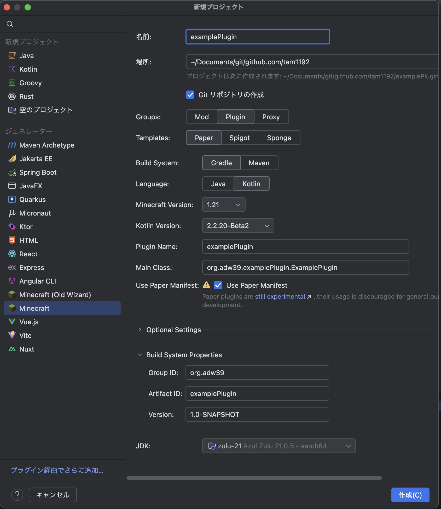

# 基礎編 part2+

前回 sdkman が使いやすいというお話を致しました。  
そして、コマンドラインの gradle で、プロジェクトを作成したのでした。

# 投稿日とバージョンについて

後述しますが、gradle はバージョンによっての変化が激しいため、先に日程と gradle の最新版の確認をお願いします。  
なお、日記さん側でも変化があったら修正するよう心掛けるつもりではありますが、放置する可能性もあるのでよろしくお願いします。

- 投稿日: 2025/07/28
- Gradle の Version: `Gradle 8.14.2`
- IntelliJ Idea の Version: `IntelliJ IDEA 2025.1.4.1 (Ultimate Edition)`
- そもそも使ってる OS: `MacOS 15.5（24F74）`

# 🎵 本日の一曲

<iframe width="312" height="176" src="https://ext.nicovideo.jp/thumb/sm43302570" scrolling="no" style="border:solid 1px #ccc;" frameborder="0"><a href="https://www.nicovideo.jp/watch/sm43302570">魔法少女はお見通し / 星界,羽累 - 織井辺コフィ</a></iframe>

まほうつかってりめせかをかがみごしにえいえんにみてたい

# intelliJ Idea はいいぞ

OSS 版もある IntelliJ Idea。  
本来は有償エディタなのですが、機能制限付き(というより、Jetbrains 製のプラグインが使えない?)オープンソース版 IntelliJ Idea は無料で使えます。  
また、**学生なら有償版も無料で使えます。**  
[JetBrains Student Pack](https://blog.jetbrains.com/ja/2019/08/22/2105/)

## IntelliJ Idea を入れてみよう。

[ダウンロードページ](https://www.jetbrains.com/ja-jp/idea/download/)
普通に入れてください。 普通に。

## (本題)マインクラフトプラグインを入れる

[IntelliJ Idea のプラグイン](https://plugins.jetbrains.com/plugin/8327-minecraft-development)として存在してます。  
前回やった gradle などの設定を大体すべて自動でやってくれる優れものです。

起動時のプロジェクト選択画面、もしくはエディタ右上の歯車アイコンにある「プラグイン」というボタンから、導入できます。

## プロジェクトを作ってみる

こんな感じで設定できます。 楽です。正直。
