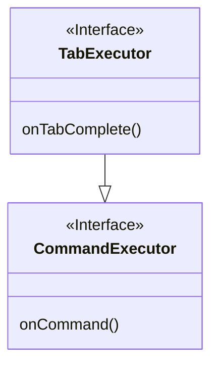

# paper 編 part1 コマンド定義

基本中の基本でありながら早速引っ掛けがあったのでメモ

# 🎵 本日の一曲

<iframe width="312" height="176" src="https://ext.nicovideo.jp/thumb/sm44423841" scrolling="no" style="border:solid 1px #ccc;" frameborder="0"><a href="https://www.nicovideo.jp/watch/sm44423841">「ブランディングができない」feat.KafU</a></iframe>

pv がしぬほどかわいい。

# CommandExecutor vs TabExecutor



```kt
import org.bukkit.command.Command
import org.bukkit.command.CommandSender
import org.bukkit.command.TabExecutor

class ExampleCommand : TabExecutor {
    override fun onTabComplete(
        p0: CommandSender,
        p1: Command,
        p2: String,
        p3: Array<out String>?
    ): List<String?>? {
        TODO("Not yet implemented")
    }

    override fun onCommand(
        p0: CommandSender,
        p1: Command,
        p2: String,
        p3: Array<out String>?
    ): Boolean {
        TODO("Not yet implemented")
    }
}
```

TabExecutor を実装すれば、**CommandExecutor と TabExecutor 両方を実装することになります**。  
TabExecutor には、onTabComplete というメソッドがあります。 これは**コマンド補完機能を提供**するものです。

**基本的には`TabExecutor`を使おう!**

## Tab 補完あれこれ

onCommand メソッドに関する情報はたくさんあると思うので、ここでは onTabComplete のメモです

基本的な使い方はこんな感じ

```kt
override fun onTabComplete(
    sender: CommandSender,
    command: Command,
    label: String,
    args: Array<out String>
): MutableList<String>? {
    return when {
        args[0] == "add" -> Material.entries.filter { it.isBlock }.map { it.name.lowercase() }.toMutableList()
        args.isEmpty() -> "add,del,list".split(",").toMutableList()
        else -> null
    }
}
```

kotlin の場合は MutableList で返すことになります。 とりあえず java では ArrayList、rust では mut Vec ですね。  
`when`が**式**なのを生かして、**when の結果をそのまま return に流してます。**

**kotlin を使うメリット 1 ですね。**

> [!NOTE]
> rust の使い勝手に近いならそれは**メリット**ですよね！(圧)
