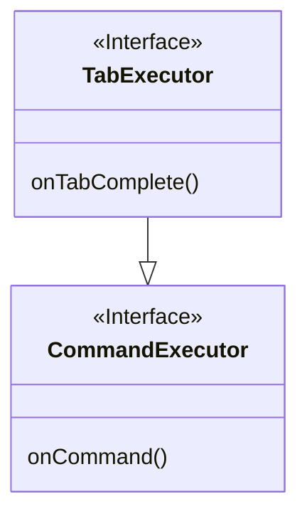
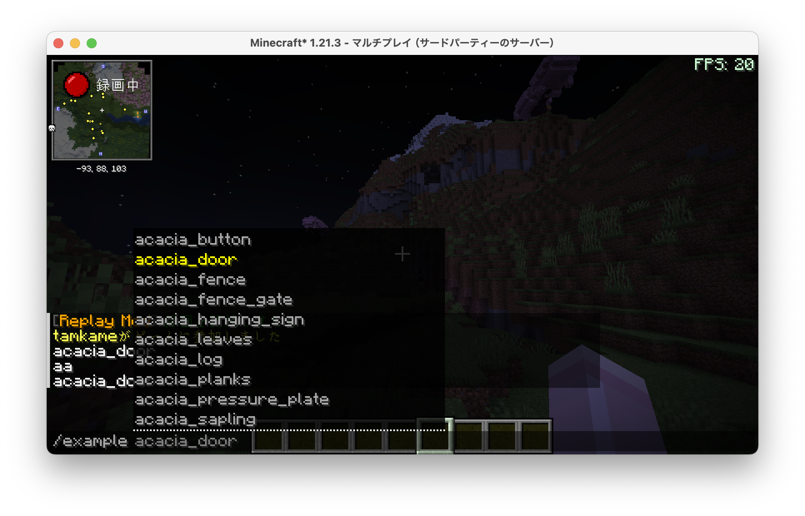

# paper 編 part1 コマンド補完　

基本中の基本でありながら早速引っ掛けがあったのでメモ

# 🎵 本日の一曲

<iframe width="312" height="176" src="https://ext.nicovideo.jp/thumb/sm44423841" scrolling="no" style="border:solid 1px #ccc;" frameborder="0"><a href="https://www.nicovideo.jp/watch/sm44423841">「ブランディングができない」feat.KafU</a></iframe>

pv がしぬほどかわいい。

# CommandExecutor vs TabExecutor



```kt
import org.bukkit.command.Command
import org.bukkit.command.CommandSender
import org.bukkit.command.TabExecutor

class ExampleCommand : TabExecutor {
    override fun onTabComplete(
        p0: CommandSender,
        p1: Command,
        p2: String,
        p3: Array<out String>?
    ): List<String?>? {
        TODO("Not yet implemented")
    }

    override fun onCommand(
        p0: CommandSender,
        p1: Command,
        p2: String,
        p3: Array<out String>?
    ): Boolean {
        TODO("Not yet implemented")
    }
}
```

TabExecutor を実装すれば、**CommandExecutor と TabExecutor 両方を実装することになります**。  
TabExecutor には、onTabComplete というメソッドがあります。 これは**コマンド補完機能を提供**するものです。

**基本的には`TabExecutor`を使おう!**

## Tab 補完あれこれ

onCommand メソッドに関する情報はたくさんあると思うので、ここでは onTabComplete のメモです

基本的な使い方はこんな感じ

```kt
override fun onTabComplete(
    sender: CommandSender,
    command: Command,
    label: String,
    args: Array<out String>
): MutableList<String>? {
    return when {
        args[0] == "add" -> Material.entries.filter { it.isBlock }.map { it.name.lowercase() }.toMutableList()
        args.isEmpty() -> "add,del,list".split(",").toMutableList()
        else -> null
    }
}
```

kotlin の場合は MutableList で返すことになります。 とりあえず java では ArrayList、rust では mut Vec ですね。  
`when`が**式**なのを生かして、**when の結果をそのまま return に流してます。**

**kotlin を使うメリット 1 ですね。**

> [!NOTE]
> rust の使い勝手に近いならそれは**メリット**ですよね！(圧)

### onTabComplete が呼ばれるタイミング

実際に調べてみます。

```kt
package org.adw39.examplePlugin2

import org.adw39.examplePlugin2.commands.ExampleCommand
import org.bukkit.plugin.java.JavaPlugin

class ExamplePlugin2 : JavaPlugin() {

    override fun onEnable() {
        getCommand("example")?.setExecutor(ExampleCommand())
    }

    override fun onDisable() {
        // Plugin shutdown logic
    }
}
```

```
package org.adw39.examplePlugin2.commands

import org.bukkit.command.Command
import org.bukkit.command.CommandSender
import org.bukkit.command.TabExecutor

class ExampleCommand : TabExecutor {
    override fun onTabComplete(
        p0: CommandSender,
        p1: Command,
        p2: String,
        p3: Array<out String>?
    ): List<String?>? {
        p3?.forEach {
            println(it)
        }
        return null
    }

    override fun onCommand(
        p0: CommandSender,
        p1: Command,
        p2: String,
        p3: Array<out String>?
    ): Boolean {
        return true
    }

}
```

> [!TIP]
> array は配列なので、forEach で中身を分解して出力します。

> [!TIP]
> 内部に Logger オブジェクトが存在しますが、println も使用できます。(多分非推奨)

`resources/plugin.yml`

```yaml
name: MyPaperPlugin
version: 0.0.1
main: org.adw39.examplePlugin2.ExamplePlugin2
description: An example plugin
author: nikki
website: https://adw39.org
api-version: "1.21.0"
commands:
  example:
    description: テスト
    usage: "/example <arg>"
    permission: org.adw39.examplePlugin2.example
```

> [!NOTE]
> ファイルの位置は、package 文をみていただくのが早いかと思います。  
> 複雑になり始めたら tree を載せます。

> [!WARNING]  
> **plugin.yaml の編集を忘れずに!!**

### 実行結果

`/コマンド名 コマンド引数1 コマンド引数2...` と入力しますが、  
実装した Executor を**`getCommand`で登録した時に用いた名前がコマンド名となります。**

コマンド名が入力され、引数を入力する際に TabExecutor が呼び出されます。  
引数の入力が変更される度に`onTabComplete`が呼び出されます。 **Tab が入力された時に呼び出されるわけではない模様**

## ブロック名で補完させる

`worldedit`のようなプラグインを作りたくなった場合、ブロック名の補完は必須です。  
最も単純な方補は、**Material**列挙型を使うことです。

> [!NOTE]  
> `minecraft:oak_log`のような表記を[**名前空間付き id**](https://hub.spigotmc.org/javadocs/spigot/org/bukkit/NamespacedKey.html)などと呼ばれるそうです。  
> 今回は名前空間を省略いたします。  
> また、ハーフブロックなどは[**ブロックステータス**](https://hub.spigotmc.org/javadocs/bukkit/org/bukkit/block/data/BlockData.html)を持つのですが、  
> こちらも省略します。

### [Material 列挙隊をみてみよう](https://hub.spigotmc.org/javadocs/bukkit/org/bukkit/Material.html)

- ACACIA_BOAT
- ACACIA_BUTTON
- ACACIA_CHEST_BOAT
  ...
- LEGACY_RECORD_12 Link icon

と、ブロック id が並んでいます。

また、メソッドには`isAir`、`isBlock`など、便利そうなものが実装されています。

### 実際に実装してみる

kotlin では、enum につく`entries`が活用できそうです。  
これは、一応 getter らしく、`()`は不要とのこと。 中身はイテレーターになってますです！

`isBlock`で block に限定し、文字列に直して mutableList で返却すれば良さそうです。

```kt
package org.adw39.examplePlugin2.commands

import org.bukkit.Material
import org.bukkit.command.Command
import org.bukkit.command.CommandSender
import org.bukkit.command.TabExecutor

class ExampleCommand : TabExecutor {
    override fun onTabComplete(
        p0: CommandSender,
        p1: Command,
        p2: String,
        p3: Array<out String>?
    ): List<String?>? {
        println(p3?.getOrNull(0) ?: "")
        return if (p3?.size == 1) {
            Material.entries.filter { it.isBlock }.map {it.name.lowercase() }.toMutableList()
        } else {
            mutableListOf("")
        }

    }

    override fun onCommand(
        p0: CommandSender,
        p1: Command,
        p2: String,
        p3: Array<out String>?
    ): Boolean {
        val block = p3?.getOrNull(0) ?: return false
        p0.sendMessage(block)
        return true
    }

}
```

entries はイテレーターですので、filter や map メソッドが活用できます。

`it.isBlock`はもはや英語として通じてしまいそうで面白いです。  
`lowercase()`にしてるのは、標準実装されているコマンド`set`などが、lowercase で入力するからです。  
(あと入力が楽)

### 実行例



# まとめ

コマンド補完は便利だから実装しよう。
