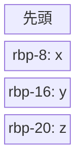

# 構文解析 part1

公開日：2025/08/28

構文解析について、お話しします。

# ひとくちメモ

彩澄姉妹が最近好きでして。  
初めて声を聞いたのは、ほんの偶然というか。ボイロ劇場みてたらナレーターとして使われてた。

<iframe width="312" height="176" src="https://ext.nicovideo.jp/thumb/sm45241088" scrolling="no" style="border:solid 1px #ccc;" frameborder="0"><a href="https://www.nicovideo.jp/watch/sm45241088">マイライフロガー / いるかアイス feat. 彩澄しゅお</a></iframe>

<iframe width="312" height="176" src="https://ext.nicovideo.jp/thumb/sm45271857" scrolling="no" style="border:solid 1px #ccc;" frameborder="0"><a href="https://www.nicovideo.jp/watch/sm45271857">【歌うVOICEPEAKカバー】メランコリック【彩澄しゅお】</a></iframe>

<iframe width="312" height="176" src="https://ext.nicovideo.jp/thumb/sm45244373" scrolling="no" style="border:solid 1px #ccc;" frameborder="0"><a href="https://www.nicovideo.jp/watch/sm45244373">稲葉曇『春難色』Vo. 彩澄しゅお & 彩澄りりせ</a></iframe>

<iframe width="312" height="176" src="https://ext.nicovideo.jp/thumb/sm44383609" scrolling="no" style="border:solid 1px #ccc;" frameborder="0"><a href="https://www.nicovideo.jp/watch/sm44383609">しゅおと宮舞のお昼寝！</a></iframe>

りりねぇが少なめですまねぇ。~~決してアレではない~~

# 参照(ポインタ)

C を学ぶ時、ポインタを知ります。 ポインタってどこで使うんだとなるわけです。  
rust にもポインタが存在しますが、**近い存在として参照があります。**

> [!TIP]  
> 一方 C にも参照は存在する

## じゃあ実際参照とポインタって何が違うんだよ

って話になるよね。  
独自研究マシマシで回答を作成してみると

rust ではポインタの登場頻度は低い方だと思います。 **参照は所有権的問題をクリアするためにある**、そういった物です。  
一方ポインタはあくまで**アドレス**のみの管理です。型も大雑把にしか管理しません。 rust では unsafe となります。

C のポインタ、参照も似てる。 ポインタはキャストすれば int を char として扱うなんて容易いし。

<details> <summary>compiler explorerで見てみる</summary>

[compiler explorer](https://godbolt.org)はコンパイラーが出力するアセンブリを表示する web サイトです。便利。

```
int main() {
    int x = 3;
    int& y = x;
    int z = x;
    return 0;
}
```

```
main:
        push    rbp
        mov     rbp, rsp
        mov     dword ptr [rbp - 4], 0
        mov     dword ptr [rbp - 8], 3
        lea     rax, [rbp - 8]
        mov     qword ptr [rbp - 16], rax
        mov     eax, dword ptr [rbp - 8]
        mov     dword ptr [rbp - 20], eax
        xor     eax, eax
        pop     rbp
        ret
```



スタックを雑にまとめるとこうなりますね。  
rbp という先頭アドレスから、いくら離れているかを載せています。

なお、アドレスはバイトごとに管理されるため、rbp-1 は、rbp から 8bit 離れているということになります。

一方で、mov は move という意味です。

```
        mov     dword ptr [rbp - 8], 3
```

なんて`rbp - 8`に 3 という値を代入(移してる)しているという意味なので、簡単です。  
lea は**アドレス**を取り出すという物です。 64bit コンピューターなので、**アドレス長は 64bit**

その位置はちょうど参照`y`になってるところです。 y は x のアドレスを持っています。

```cpp
int main() {
    int x = 3;
    int *xp = &x;
}
```

ポインタで書き直しました。

```asm
main:
        push    rbp
        mov     rbp, rsp
        mov     dword ptr [rbp - 4], 3
        lea     rax, [rbp - 4]
        mov     qword ptr [rbp - 16], rax
        xor     eax, eax
        pop     rbp
        ret
```

やってることはほとんど同じですね。

</details>

rust では安全な参照が、c ではポインタがよく使われています。  
参照が安全なのは前述の通り、rust ではアドレス以上に所有権などの考慮もしながら扱う物だからです。多分。

アセンブリからしたら型もくそもないけれど、コンパイラの時点で変数が用途通り使われているのを確認できているので問題ないのです。

## 指定した容器に情報を詰め込んで

今マイバック持参とかあるじゃないですか。あとマイカゴ。  
マイカゴって、スーパーのレジ店員に渡すと**そのまま品物を中に詰めてくれる**ので、こちらとしてそのまま車に詰め込んで、持ち帰って終わるだけなので楽なんですよね。

```rust
#[derive(Debug)]
struct Goods<'str> {
  _name: &'str str
}

fn registrar<'str>(mut unpurchased: Vec<Goods<'str>>, mybag: &mut [Option<Goods<'str>>]) -> (usize, Vec<Goods<'str>>) {
    let mut counter = 0;
    for i in mybag.iter_mut() {
        if i.is_none() {
            *i = unpurchased.pop();
            counter += 1;
        }
    }
    (counter, unpurchased)
}

fn main() {
    let unpurchased_list = vec![Goods{_name: "pan"}, Goods{_name: "kome"}, Goods{_name: "tofu"}];
    let mut my_bag: [Option<Goods>; 2] = [None, None];

    let (size, pra_bag) = registrar(unpurchased_list, &mut my_bag);

    println!("レジ袋: {:?}", pra_bag);
    println!("マイバッグに入れられた品物: {:?}", my_bag);
    println!("マイバッグに入れられた品物の数: {}", size);
}
```

というのを想像して書いてみたらこういうプログラムができました。  
`Clone`を実装してないので商品(`Goods`)は move のみできます。現実の商品コピーできないからね。

レジ(`registrar`)にはカゴ(`unpurchased_list`)とマイバッグ(`my_bag`)を渡します。  
なお、**マイバックは一時的に貸しているものであり、帰ってきます。** 参照渡しとはそういうことです。

会計が済めば、入り切らなかった商品がレジ袋(`pra_bag`)に詰められて帰ってきます。  
丁寧な店員なので、マイバッグに入った品物の数も答えてくれました。

<span style="color: red;">「あんちゃんが渡してくれた袋に二品つっこめたで」</span>

ポインタのほんの一つの使い方はこんな感じです。  
rust では一時的に貸すという表現ができますねぇ。

### そのまま渡して返して貰えばいいのでは？

~~レジ袋って無駄だと騒がれてるじゃん？~~  
C 言語の関数の戻り値ってアドレスが異なるのです。  
正しくは、関数の結果を変数にコピーするという動作を行ったはずです。

rust ではあんまり関係ないですが。少なからず戻り値での受け渡しは無駄が生じる可能性があるということです。

また、現実の my_bag 同様、**変数の再利用ができます。**
変数って作るときに**コスト**が生じます。 特に Box で作るとなると、ヒープ確保にコストがかかります。  
java なら GC があるので、GC が回収するオブジェクトが無駄に増えることになります。

変数って単純なようで奥深いです。 rust ではトレイトがあります。  
トレイトオブジェクトでリストを管理すれば、変数の扱いを自分なりにカスタマイズできるようになるのです。

とにかく、**自分が用意したものを相手に使ってもらいたい時に、ポインタは有用だということなのです。**

> [!NOTE]  
> rust では参照です。

## 関数をやり取りする時

関数を変数として扱うことがあります。

```rust, ignore
fn func() {}

fn main() {
    let f = func;
}
```

rust においてこの構文は、f は関数の参照を持っているという扱いになります。  
計算に使用される数値、文字を表現するために使われる文字列。これらは値として管理することができます。  
一方で、関数は値というより、式の一つと考えられます。 式が値になるというこんがらがるような状況になります。

しかし関数値というのは存在しません。関数を **「指し示す」** 参照が存在するだけです。
参照は「**値**」です。

**関数をさす参照**という値を使うことで、**引数を通じて他の関数に関数を渡すことができます。**

> [!TIP]  
> C では関数ポインタが使われます

### コールバック関数

それこそがコールバック関数です。

```rust
#mod my_crate {
#    use std::time::Duration;
#    use std::thread::sleep;
#
#    pub fn callback(func: impl FnOnce(&str)) {
#        sleep(Duration::from_secs(2));
#        func("callback");
#    }
#}
#
fn func(i: &str) {
    println!("hello world {}", i);
}

fn main() {
    let f = func;
    my_crate::callback(f);
}
```

`my_crate::callback`は、my_crate というクレート（つまりライブラリ）の`callback`という関数のことです。
コードをあえて隠してますが、表示すればモジュールが見えるはずです。

callback という関数は、2 秒待機した後にユーザーが指定した関数を呼び出します。  
呼び出される関数はユーザーが自由に設計できます。(ただし引数と戻り値は一致しなければならない)

### コールバック関数の出番

- 〇〇した後に呼び出す(処理順序)  
   主に**非同期処理**で見られます。 非同期でなくても、マルチスレッドで可能。  
   処理が終えた時にユーザーの関数を実行するという動作をします。
- 関数の自由度を高めるため  
  引数、戻り値だけを指定し、ユーザーに処理を考えて欲しいことがあります。 あとで出てきます。

> [!NOTE]
> イベント駆動する javascript では、イベントとして関数を登録し、ファイルが読み込み終わった時などにイベント発火として関数が呼び出されます。

### 関数を作る関数

ややこしい概念です。

```rust
fn func_builder(msg: &str) -> impl Fn(&str) {
    let msg = msg.to_string();
    move |user| println!("dear {}\n{}", user, msg)
}

fn main() {
    let f = func_builder("hello! have a nice day!");
    f("nikki");
}
```

`|| {}`はクロージャです。 他言語ではアロー関数、ラムダ関数とか呼ばれたりします。  
特徴として、値のように**関数の中で関数が定義でき**ます。

`Fn`トレイトは、関数トレイトです。 関数型として変数を管理することができます。
戻り値を関数型にするために使ってます。 先ほどは引数にも使ってました。

# コンビネーター

callback 関数は他に、関数を加工する時、関数を組み合わせる時に便利に使われます。

```rust
fn can_i_help_you() {
    println!("いらっしゃいませこんにちは");
}

fn booko0f(func: impl Fn()) {
    for _ in 0..3 {
        func();
    }
}

fn main() {
    booko0f(can_i_help_you);
}
```

関数を組み合わせて機能を強くする例です。~~ブック ⚪︎ フか。~~

# パーサー

こういうやつです。

```rust
fn digit_parser(i: &str) -> (&str, Option<i32>) {
    let n = i.find(|c: char| !c.is_ascii_digit()).unwrap_or(0);
    if let Ok(res) = i[0..n].parse::<i32>() {
        (&i[n..], Some(res))
    } else {
        (&i, None)
    }
}

fn main() {
    let x = "123hello";
    let (x, y) = digit_parser(x);
    println!("{:?}, {:?}", x, y);
}
```

文字列から数値だけ抽出します。 その後、数値と文字列を分割して出力します。  
rust ではシャドーイングする設計にすると綺麗です。

# パーサーコンビネーター

```rust
fn digit_parser(i: &str) -> (&str, Option<i32>) {
    let n = i.find(|c: char| !c.is_ascii_digit()).unwrap_or(0);
    if let Ok(res) = i[0..n].parse::<i32>() {
        (&i[n..], Some(res))
    } else {
        (&i, None)
    }
}

fn looparser<P, T>(parser: P) -> impl Fn(&str) -> (&str, Option<(&str, T)>)
where P: Fn(&str) -> (&str, Option<T>)
{
    move |i| {
        for n in 0..i.len() {
            let (i2, res) = parser(&i[n..]);
            if let Some(res) = res {
                return (i2, Some((&i[..n], res)))
            }
        }
        (i, None)
    }
}

fn main() {
    let x = "hello123world";
    let (x, y) = looparser(digit_parser)(x);
    println!("{:?}, {:?}", x, y);
}
```

コードが急にカオスになりました。

### looparser

~~名付け適当~~ digit_parser は「**数文字が先頭から続く範囲で**数値を取り出します。」  
つまり、途中の数値は取り出されません。

```rust
fn digit_parser(i: &str) -> (&str, Option<i32>) {
    let n = i.find(|c: char| !c.is_ascii_digit()).unwrap_or(0);
    if let Ok(res) = i[0..n].parse::<i32>() {
        (&i[n..], Some(res))
    } else {
        (&i, None)
    }
}

fn main() {
    let x = "hello123";
    let (x, y) = digit_parser(x);
    println!("{:?}, {:?}", x, y);
}
```

数値が後ろになるだけでパースできなくなりました。
looparser では、**パーサーが成功するまで文字列の先頭をずらしながら試行錯誤する**という物です。

よって、"hello123world"では、6 文字目から digit_parser が成功し、数値に変換して返すということができるようになりましたとさ。

## パーサーという関数を受け入れる関数

looparser では、関数をあたかも**Parser というオブジェクトのように扱っています**。  
こういった時にも関数ポインタは必要になるのですね。

## コード解説

```rust, ignore
fn digit_parser(i: &str) -> (&str, Option<i32>) {
    let n = i.find(|c: char| !c.is_ascii_digit()).unwrap_or(0);
    if let Ok(res) = i[0..n].parse::<i32>() {
        (&i[n..], Some(res))
    } else {
        (&i, None)
    }
}
```

i は文字列。 `str.find()`は、引数にコールバック関数を入れます。  
ここでもコールバック関数がっ...

コールバック関数の引数は char にしておきます。 そうすることで、find メソッドがコールバック関数に先頭から文字を一文字づつ入れて、試してくれます。  
コールバック関数の戻り値は bool です。 true を返すと、成功(=条件に合う文字)と判定されます。

つまり、find メソッドは先頭から一文字ずつ試していき、条件に会う文字を見つけたらその文字があるインデックスを返すというメソッドになります。

### 戻り値

戻り値は(&str, Option)という形をとってます。

```rust, ignore
let base = "123hello";
let (base, res1) = parser1(base);
let (base, res2) = if res1.is_none() {
    parser2(base)
} else {
    (base, None)
}
```

まぁこんな感じの書き方ができるよねってことで。

## クロージャのキャプチャ

```rust, ignore
fn looparser<P, T>(parser: P) -> impl Fn(&str) -> (&str, Option<(&str, T)>)
where P: Fn(&str) -> (&str, Option<T>)
{
    move |i| {
        for n in 0..i.len() {
            let (i2, res) = parser(&i[n..]);
            if let Some(res) = res {
                return (i2, Some((&i[..n], res)))
            }
        }
        (i, None)
    }
}
```

`move`というのは所有権関係の物です。  
looparser のスコープには`parser`というこれまた関数オブジェクトが存在します。  
この`parser`の所有権を、クロージャに移動することを認める一言になってます。

クロージャ内部では、キャプチャした parser オブジェクトがそのまま使えます。
つまり、**looparser でうけっとったコールバック関数を、クロージャ内部で使うことができる**ということになります。

looparser は戻り値で関数ポインタを渡してきますが、**そのクロージャでも looparser が受け取ったコールバック関数が引き続き利用可能です**。

> [!NOTE]  
> impl について、これをつけておくとプログラムサイズを犠牲に、どんなものにも対応できるように関数が作られます。  
> どういうことかって、トレイトは本来、**実体しないもの**です。 **サイズがわかりません。**  
> おそらくトレイトが実装されている元のオブジェクトをたどって、どんなオブジェクトも受け入れられるように関数を作る、そういうことだと勝手に理解してます。
>
> なお、引数で impl を使うときは**ジェネリクスと where で一度定義する必要があります。**

# 今回のまとめ

ポインタからコールバック関数、そしてパーサーコンビネーターまでとりあえず纏めてみました。  
本題まで行けてないのが悲しい。

# 本日の二言

本日が終わるまであと 4 時間です。 急いで書きました。  
え？何してたって？ 単純に記事のボリュームがデカすぎるという問題もあるのですが、MyParserProject どうしようかなって考えてました。  
実はそれをいじってて急遽書いた記事でもあります。

...それだけじゃないだろって？

あのですね。 ブルアカってゲームあるじゃないですか。  
最近ワイルドハント芸術学院という学院が追加(※)されまして、そこに所属する二人が予想以上に可愛くてね。

> [!NOTE]  
> いろんな記事曰くワイルドハント芸術学院自体はリリース初期から存在するそうです。  
> 所属するキャラがプレイアブルキャラクターとして追加されたのは**正真正銘今回が初です。**

魔女っ子よくね？ やっぱいいよな。白尾エリめっちゃいいよな？

いや、ワイルドハント芸術学院、能力的には他のキャラで代用できるし、そもそも進化用のノートが独自の枠だから集めるのめんどいし  
ぶっちゃけ微妙だよな... 引こうかな...

でもチケット 2 枚残ってるんだよね

...

<details><summary>結果</summary>

🟦🟨🟦🟦🟦  
🟦🟦🟦🟦🟦

🟦🟨🟦🟦🟦  
🟦🟦🟦🟨🟦

</details>
