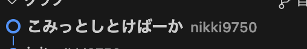

# コミットしろよ

この記事は表現が(多少)過激であり、職場または学校、学習で見るのにふさわしくない内容です。

より良い情報は[qiita などの記事](https://qiita.com/itosho/items/9565c6ad2ffc24c09364)を参考されることを**強く推奨**します。

記事をみる

  
(このコミットは完全に個人プロジェクトで行ったものです)

過去の自分に対する強い怒りをコミットメッセージに込めました。  
というのも、**このコミットで何をしたのか理解できなかったから**です。

もしトイレで席を離れる場合は**コミットだけはしましょう**  
このレベルでコミットはすべきなんです。私はそう思う。

