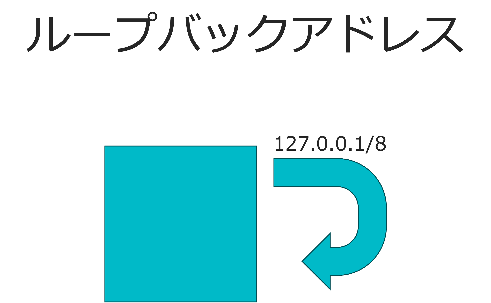
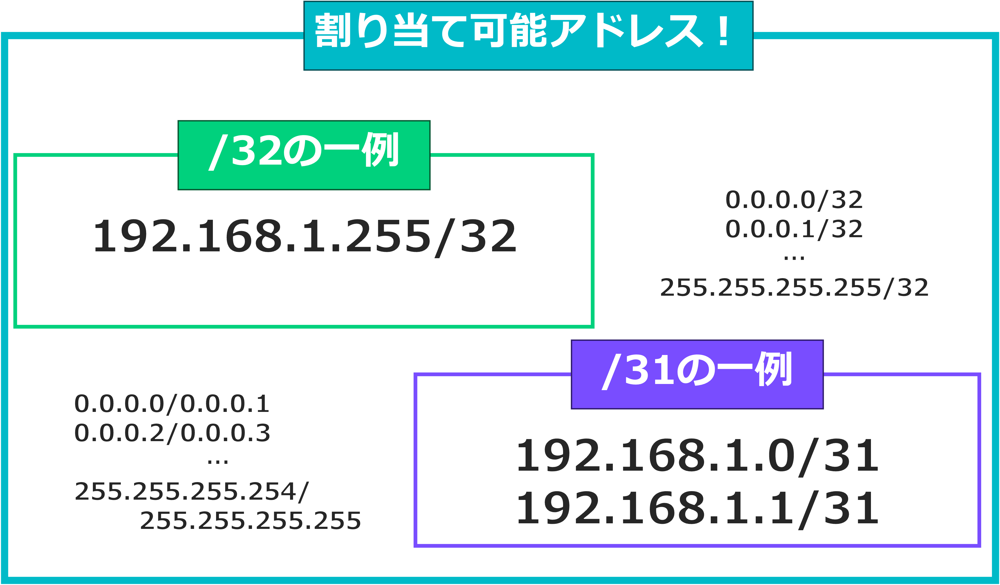
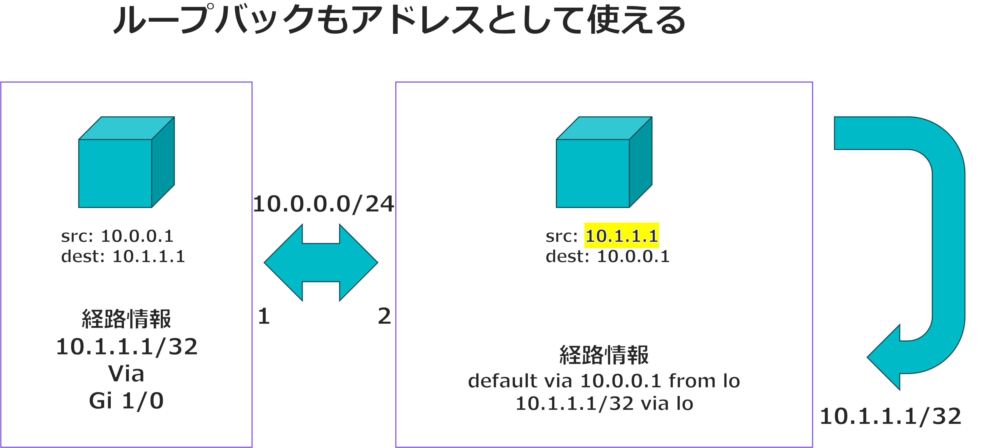

# ループバックアドレスでIP節約

(ダークモードだと見づらいのは気のせいです。)

ということで、ループバックアドレス使って極力IP減らしました。

> [!note]
> この記事は、とある理由でグローバルIPなど特定のIP（以下グローバルIPという）の割り当てを減らしたい人向けに書いております。  
> 自宅など、プライベートアドレスの節約については書いておりません。  
> 
> プライベートIPとグローバルIP(/32)をうまく併用すれば、グローバルIPを節約しつつネットワークを構成できます。
> 
> 本記事では、ループバックアドレスや/32, /31の使い方に加え、プライベートIPとの併用によるIP節約テクニックを紹介します。

## 結論1


`/32`と`/31`を使うと無駄なIPが減ります！

### 無駄なIPって？
ここでは、無駄なIPとは、次のアドレスのことを言う。

- ネットワークアドレス
- ブロードキャストアドレス

おいおいまてよ、二つとも本当に不要なのかい？  
と思うかもしれません。 まぁぶっちゃけ不要じゃね？知らんけど。

とにかくこの二つは機材にアサインすることもできないし、  
機材にアサインできないってことは、サーバーとして使えるアドレスじゃないし

> [!WARNING]  
> 私はたまに適当なこと言います、気になったら調べてほしい

### じゃあ消そう！とはいかない
ネットワークを構成するには、RFCというお約束により、
上記二つのアドレスは一部の例外を除いて必ず発生してしまうのです

### 無駄なIPが消える例外なネットワーク
そもそも例外なネットワークはまず、ネットワークと言っていいのかわかりません。  
ネットワークって複数の機材を繋げあう技術でしょう？

#### 例外1: /31 一対一のネットワーク
コンピューター間を一対一で繋げる場合は、/30と/31が用いられます。  
このうち、/30はアドレス空間的に4つのアドレス(32-30=2[bit]=4通り)割り振れて、  
/31はアドレス空間的に2つのアドレス(32-31=1[bit]=2通り)割り振れます。

しかし、無駄なアドレス二つを割り振ろうとすると、  
/30で使える実際に使えるアドレスは2つになり、
/31に至っては0になります。

実はここで例外が発生します。/31のように、無駄なIPによって実際に割り当てられるアドレスが0になる場合、
無駄なアドレスは発生しなくなるのです。

すなわち、/31は二つのアドレスが使用可能となります。

...実は、/31は長年議論されていたようで、古いルーターですと設定できないみたいです。

#### 例外2: /32 一つのアドレス
/32はもはやアドレス一つを指します。　ネットワークを構成できません。
/31の時のように、例外が発動します。

/32の用途はこのあと例に挙げますが、ネットワークを構成する必要がない、自分自身を示す際に使用できます。

#### 例外まとめ
そもそも例外と言ってますけど、二つのアドレスの意味を考えると
- ネットワークアドレス  
  /32はそもそもネットワークともいえない   
  /31は設定する余裕がない
- ブロードキャストアドレス  
  /31も/32もブロードキャストするメリットがない

ということで、必要がなくなるというわけです。

### 結論1まとめ


冒頭にもあるこの図のように、/31と/32を使えば、隅々にまでアドレスを割り当てることが可能となります。

## 結論2



こっちは簡単です。  

冒頭のノートに述べた通り、**基本はプライベートIPを使用しつつ、/32で割り当て可能なループバックにグローバルIPアドレスを使うことでIPを節約します。**

その、ループバックアドレスで通信する方法ですが、ループバックアドレスを上流ルーターに経路通知すれば、通信が可能になるってことです。  

> [!WARNING]  
> 懸念点を挙げるとすれば、ループバックアドレスを設定した機材からは、ループバックアドレスを使って外に出るようにしなければならないことです。 図にも黄色蛍光ペンで強調させてますが、パケットのsrcがloopbackアドレスのものにならなければならないということです。  
>
> **この設定が可能でないと、この手法はとれないことになります**。


### netplanの場合
netplanの場合はroutesの中で**from**が使えます。　これを設定することにより、loアドレスからパケットが送出されるようになります。

```yaml
network:
  version: 2
  ethernets:
    lo:
      addresses:
        - 10.1.1.1/32
    enp1s0:
      dhcp4: false
      dhcp6: false
      accept-ra: false
      addresses:
        - 10.0.0.2/24
      routes:
        - to: default
          via: 10.0.0.1
          from: 10.1.1.1
      nameservers:
        addresses:
          - 8.8.8.8
          - 8.8.4.4
```

### /31はあまり意味がない
L3スイッチなどのポートごとに1つ、さらに相手側（仮想サーバーなど）にも1つIPを割り当てる必要があり、結局2つ消費します。
一方、/32とプライベートIP（例えば 192.168.x.x など）を併用すれば、プライベートIPは枯渇しにくいので、  
L3スイッチ側はプライベートIPを割り当て、相手側のループバックにグローバルな/32を割り当てれば済みます。

要するに、/32＋プライベートIPでやらないとIP節約につながらないのです。
(一つのサーバーで複数のグローバルIPを使いたいなら別)

# まとめ
ループバックアドレスや/32の活用、そしてプライベートIPとの併用によって、  
無駄なグローバルIP消費を最小限に抑えることができます。IP枯渇対策の一案としてご参考まで！

...という今更の話題でした。

# 参考
- [Netplan documentation(routing)](https://netplan.readthedocs.io/en/stable/netplan-yaml/#routing)