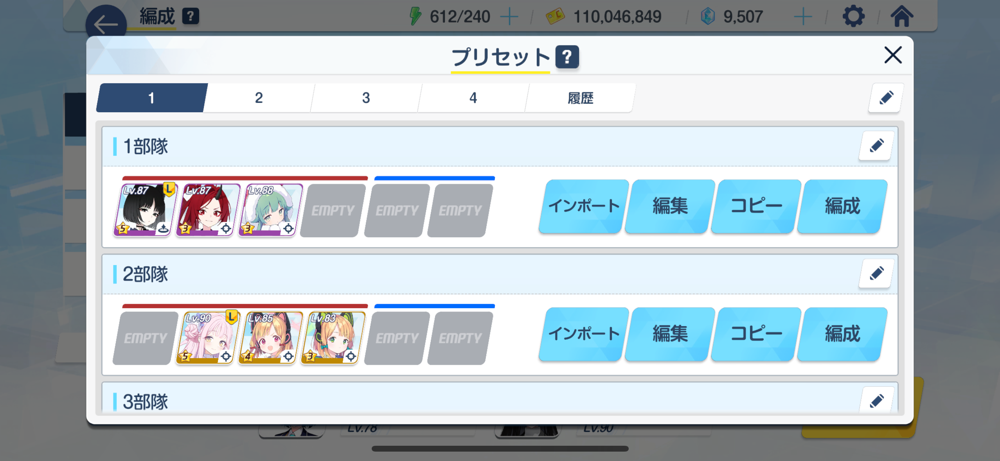

# チャレンジミッション全クリを目指して

  
ブルアカのチャレンジミッションを全クリしたい。

> [!WARNING]  
> この記事は攻略を目的としておらず、ただのメモにすぎません。  
> もっといい方法があると思います。

# やり方

[神ゲー攻略の「【ブルアカ】任務攻略一覧と編成おすすめキャラ」](https://kamigame.jp/bluearchive/page/142389888455595105.html)をみてクリアする

攻略みるのは邪道だと言われるかもしれないけど、これ普通に辛い。  
というのも、24 年の周年イベで追加された**簡易攻略が使えない**。

# 星 3 がむずいなら簡易攻略で代用可能

集中指揮、簡易攻略共に星は共通なので、簡易攻略で星３を目指し、集中指揮でチャレンジミッションはあり。  
ただし時間は 1.5 倍、スタミナ 2 倍になるけど。

# 編成組むのがめんどくさい

エリアごとに使う編成が結構変わるので、プリセットを活用したい。  
しかし、キャラ数少ないなら、**プリセット自体に登録するキャラを減らすと楽に編成できる。**

 

(特にスペシャルのキャラは枯渇しがちだから外して柔軟に組めるようにしてる)

# チャレンジ、星 3 目指すぐらいなら...

**まず normal の area25 を目指せ**

理由: カフェランクを上げれるから  

スタミナが多ければ、**イベントの周回ができる。**  
ぶっちゃけ**イベント周回の報酬の方が嬉しい**

# これをやるタイミング

イベントがない時。 カフェランク max の時。  
ガチャの石稼ぎするくらいなら、イベント進めた方が石が入ると思う。  
チャレンジミッションおよび hard のプレボは暇な時に獲得しておくといいと思う。

カフェランクはあげると**レベルが上がりやすくなる**  
ぶっちゃけ**簡易攻略ならレベル足りてなくても回せる**と思う。

# 2025/08/15

イベントもねぇ、なんもねぇ。  
チャレンジミッション消化することとした。  
1 時間でおおよそ 2 エリアぐらい攻略できる気がする。

ボス戦もオートで回るので、攻略通りにパズルクリアして、終わるだけなので、
動画みながらやってた。

# まとめ

ミカセイを推せ(4.5 周年でなぎちゃん当たらなかった人)  
[img5](./img5.png)
