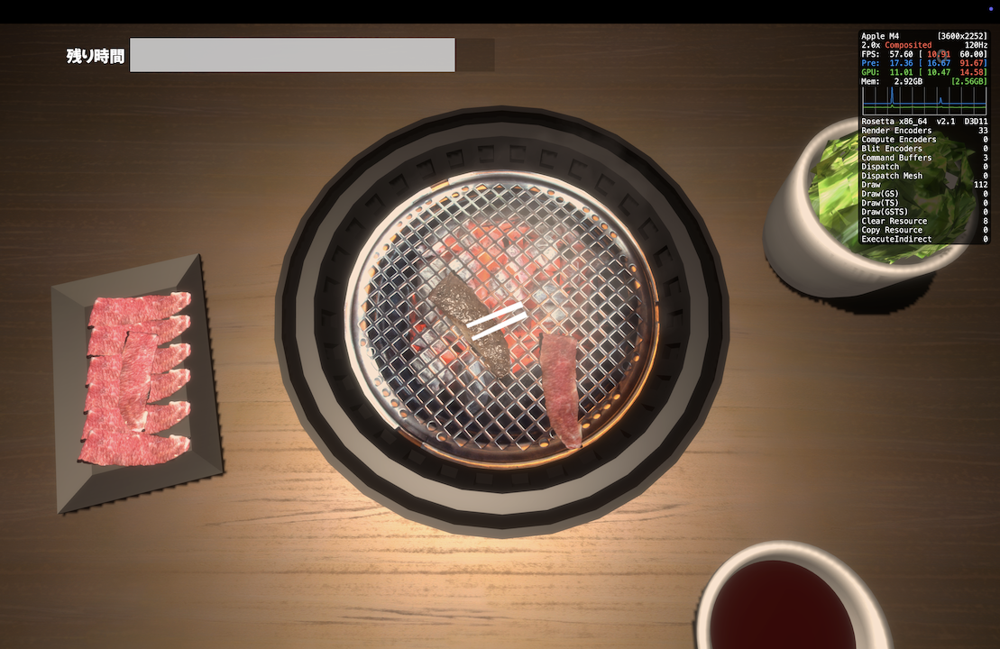
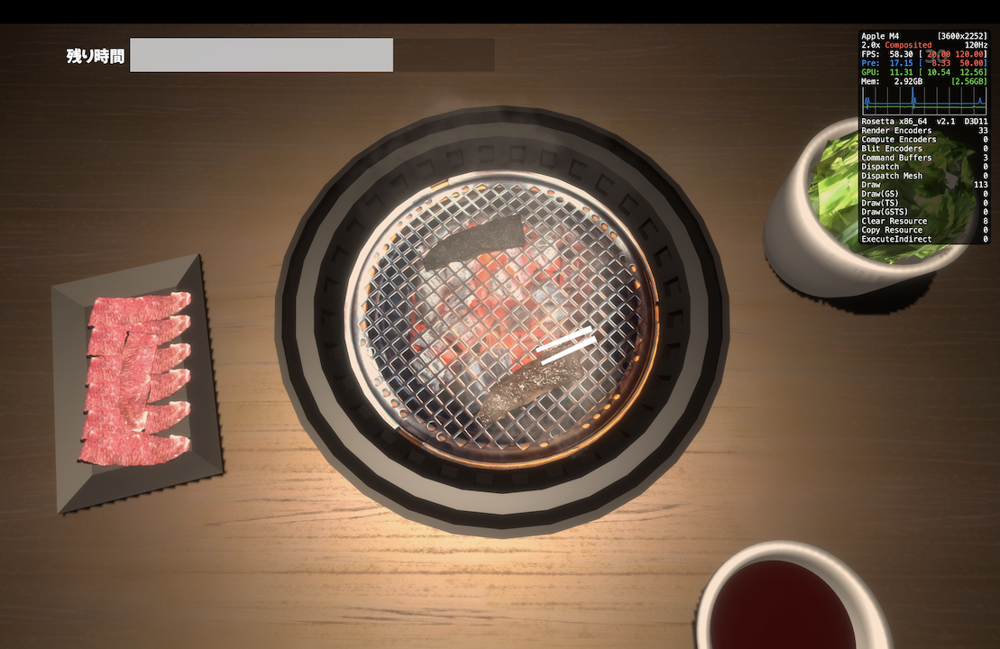

# 焼肉シミュレーターやってみた

<iframe src="https://store.steampowered.com/widget/2001570/" frameborder="0" width="646" height="190"></iframe>

猛烈に焼肉が食いたかったので

## 動作環境

macOS 遣いなワシ、windows のみの対応だったので、いつもどおり wine([Kegworks Winery](https://github.com/Kegworks-App/Kegworks))でやってます。

> [!NOTE]
> wine とは mac 民や linux 民といった~~特殊民族~~非 windows 民が、windows 向けのプログラムを実行させるためのプログラムです。  
> オンライン対戦などはシステム上、**チートが疑われてしまうため、windows でプレイすることが推奨されてます**。

## チャレンジモードやってみた

メインメニュー一番上から攻めるのが王道だと思って。

画像のような色に焼きあがれば高得点になる。

> [!NOTE]  
> 撮影当時で私の最高点数は 80 点だった

## すぐ焦げる

タイミングよく焼かないと、黒焦げになってしまう。  
**マイナス点になってしまうため、なんとしても阻止したい**

# まとめ

やきにくくいたい
