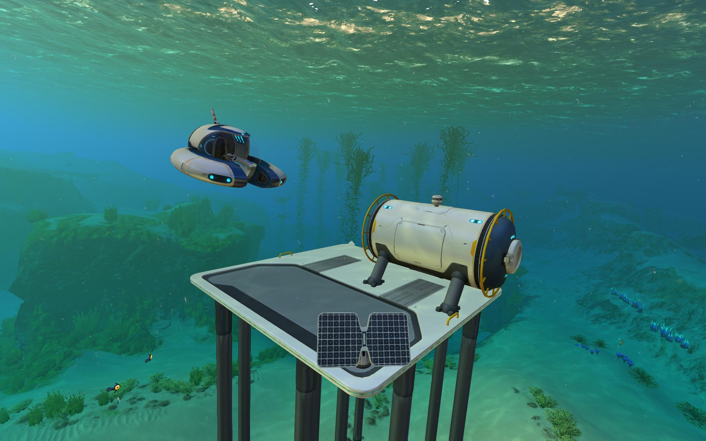

# subnautica やってみた

海ばかりの星に墜落してしまうゲームやりました。

## 難易度は割と低い

難易度はかなり低いほうだと感じます。  
マイクラを除くこういったゲームあるあるで、**飲料資源が少ない**なんて問題もないし。  
肉もそこらじゅうにあるので取り放題です。 調理も燃料いらずだし。

## ストーリーが気になる

ストーリーの奥が深いと聞いたことがあります。 さらに進めたらまた感想も書こうかな。

## シーモスよき

最初の画像に写ってる、ufo みたいなやつがシーモスです。 こいつはアプグレなしで海中 200m まで潜れます。  
しばらくはこいつの世話になりそう

## (2025/08/11 追記)プレイを終えて

改めて、難易度は低いと思う。 日記さんでもクリアできた。  
(※日記さんはとんでもなくゲーム能力低いです。~~AI 使ってヒント得てたなんて口が裂けても言えない~~)

探索要素が多く、ストーリーからヒントを得ることも多かったです。

終始ぼっちだったのがつらかったです

## (2025/08/11 追記)subnautica2 が出てくるらしい。

なんと**マルチ対応**らしい。 2026 年あたりに出るらしいので、覚えてたらやりたいよね。

# ゲームリンク

<iframe src="https://store.steampowered.com/widget/264710/" frameborder="0" width="646" height="190"></iframe>

## 同シリーズのゲーム(未公開、アーリーアクセスなど込みで)

<iframe src="https://store.steampowered.com/widget/848450/" frameborder="0" width="646" height="190"></iframe>

<iframe src="https://store.steampowered.com/widget/1962700/" frameborder="0" width="646" height="190"></iframe>
