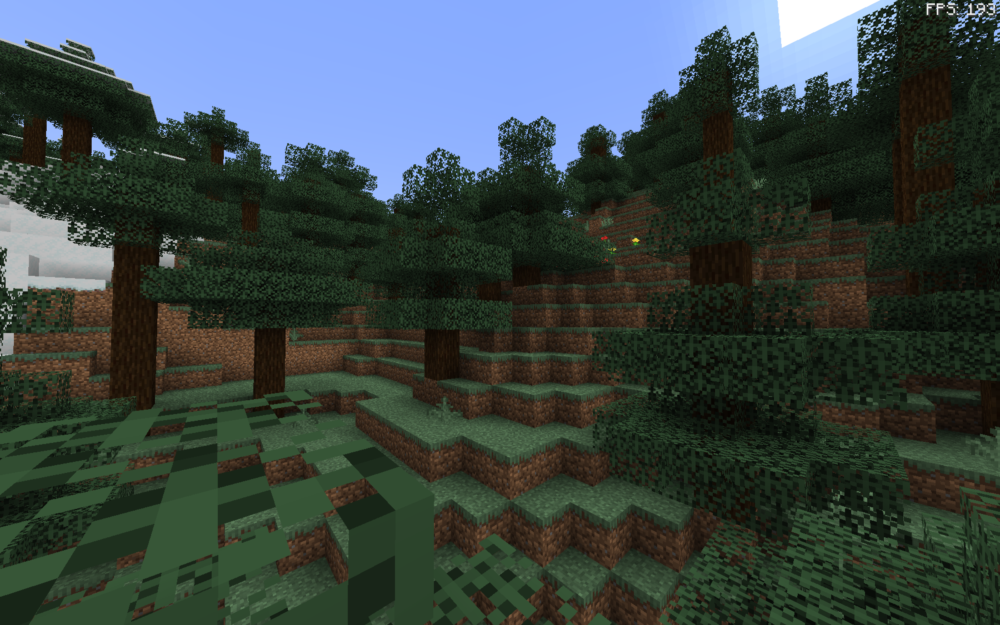

# RenderScale はいいぞ

公開日: 2025/08/23

今でっかい記事書いてるので今日はこれで勘弁してください。

# 4K8K と AI 時代の処理軽量化術について

FSR2.0 や DLSS って知ってますか？ 最近のゲームなどではよくみられるようになりました。  
これらの技術は解像度の低いグラフィックからアップスケールする際に使われる**AI 技術(DLSS)や、エフェクトで誤魔化す技術**です。[^参考1]

つまり、低い解像度でレンダリングして、アップスケールするという技術になります。

**マイクラでも同じようなことできないだろうか？**.

[RenderScale](https://modrinth.com/mod/renderscale)では、単純なアルゴリズムで似たようなことを実現可能と**思いました。**

## 使ってみた感じ

通常がこんな感じ

多少下がるけど、影 mod が 40FPS から 60FPS 超えるようになりました。

## アップスケール目的だと思ってた

最初は軽量化 mod だと思って導入してみましたが、実際どうなんでしょうか。  
どうやら、スクリーンショットのアップスケールの方が目的に近い気がします。  
とはいえ、作者が紹介ページに FSR 対応するかもと書いてましたし、使い方としては間違えてない気がします。

# 超解像度技術の今後に期待したい

綺麗なディスプレイを使うと、FHD サイズに落とすと違和感を感じます。  
違和感のないグラフィックで FPS を向上させようとなると、こう言った技術が使えるわけですね。

え？FHD ディスプレイにすればいいだろって？QoL が...()

# 参考

- [^参考1]: [今さら聞けない画質を維持しつつ fps を上げる RSR＆FSR の使い方【AMD チップス集】](https://ascii.jp/elem/000/004/113/4113900/)
