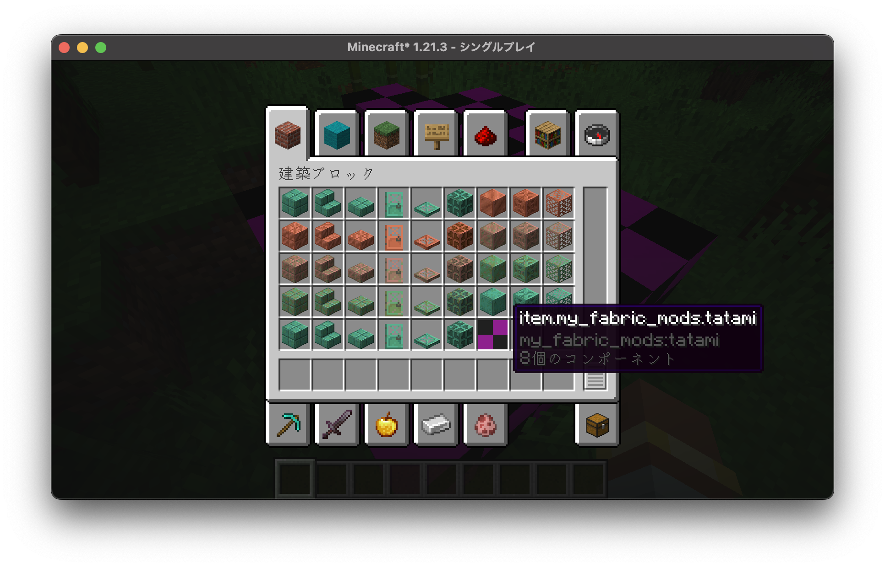

# fabric 編 part2 とりまブロックを追加してみる

冷静にリファレンスを読めば良かったものを...

> [!NOTE]  
> 作業環境
>
> - 日付: 2025/08/16
> - 言語: kotlin
> - バージョン: 1.21.3
>
> ```
> minecraft_version=1.21.3
> yarn_mappings=1.21.3+build.2
> loader_version=0.17.2
> kotlin_loader_version=1.13.4+kotlin.2.2.0
> # Mod Properties
> mod_version=1.0-SNAPSHOT
> maven_group=org.adw39
> archives_base_name=MyFabricMods
> # Dependencies
> # check this on https://modmuss50.me/fabric.html
> fabric_version=0.114.1+1.21.3
> ```

# 今日のひとこと

<iframe width="312" height="176" src="https://ext.nicovideo.jp/thumb/sm45244373" scrolling="no" style="border:solid 1px #ccc;" frameborder="0"><a href="https://www.nicovideo.jp/watch/sm45244373">稲葉曇『春難色』Vo. 彩澄しゅお & 彩澄りりせ</a></iframe>

一回聞いてすぐ好きになったので共有したくなった。

<details><summary>続きをみる</summary>
<iframe width="312" height="176" src="https://ext.nicovideo.jp/thumb/sm44383609" scrolling="no" style="border:solid 1px #ccc;" frameborder="0"><a href="https://www.nicovideo.jp/watch/sm44383609">しゅおと宮舞のお昼寝！</a></iframe>

もうしゅお好き。

<iframe width="312" height="176" src="https://ext.nicovideo.jp/thumb/sm45255958" scrolling="no" style="border:solid 1px #ccc;" frameborder="0"><a href="https://www.nicovideo.jp/watch/sm45255958">宮舞モカニャン軽音部へ行く！</a></iframe>

MYAAMAI!! な花梨ちゃんすこ

</details>

# 今日のふたこと

ちょっとお試しで、劇場風な感じに説明してみたいと思います。(~~決して罰ゲームではない~~)  
E さんと I さんによる掛け合い的な説明にします。

<details><summary>マジでしょうもない設定</summary>

ちなみにネームスペースで言うところのこんな感じ

```rust, ignore
mod world {
    struct Human();
    let nikki = Human::new();
    mod nikki_world {
        struct People();
        let E_san = People::new();
        let I_san = People::new();
    }
}
```

セキュリティ的に(?)外部参照できない感じなので、E さんも I さんも日記と言う存在を認知できないです。

</details>

あと、前回**クラス名やパッケージ名が不思議だったため、手作業修正しました**。
| 変更前 | 変更後 | 補足 |
|---|---|---|
| `org.adw39.myfabricmods` | `org.adw39.my_fabric_mods` | `-`区切りの方が正しいらしい... |
| `Myfabricmods` | `MyFabricMods` | |

# ブロック追加してみる

<span style="color: red;">E: プログラム書く E ちゃんやで。</span>  
<span style="color: blue;">I: 隣で見守る I です。</span>

<span style="color: red;">E: 前回のおさらいで**アイテムの追加と、クリエイティブモードのインベントリに追加するところまで**やったで</span>  
<span style="color: blue;">I: 今回は、**実際に置けるブロックを作るところまでやるの？**</span>  
<span style="color: red;">E: せやで。 リファレンスそのままコピペでなんとかなるからすぐ終わるはずや！</span>  
<span style="color: blue;">I: **ほんとかな 心配だな**</span>

## kotlin を最大限有効活用する

<span style="color: red;">E: あそうだ、その前にやりたいことがあるねん</span>  
<span style="color: blue;">I: なに？</span>

<span style="color: red;">E: [`ModInitializer`](https://maven.fabricmc.net/docs/fabric-loader-0.11.3/net/fabricmc/api/ModInitializer.html) を実装してる `MyFabricMods` を**クラスから kotlin オブジェクトに変更**するで</span>  
<span style="color: blue;">I: 何が変わるの？</span>  
<span style="color: red;">E: 正直そこまで変わらないで[^c1]</span>  
<span style="color: blue;">I: そうなの？ 調べてみたら、**シングルトンを簡単に作れるって**書いてあったけど</span>  
<span style="color: red;">E: さすが A ちゃんやな!</span>  
<span style="color: blue;">I: I です。</span>  
<span style="color: red;">E: さすが I ちゃんやな! **すぐ調べるのは大切**や！</span>  
<span style="color: blue;">I: **一つのインスタンスを使い回すようだね。**</span>  
<span style="color: red;">E: どれだけ新しくインスタンスを立てても、**結局は全て同じインスタンスになる**んやで。 **インスタンスがごちゃ混ぜにならないから、システムの核心的なところでよくみる**で</span>  
<span style="color: blue;">I: **お姉ちゃんは mod の中心部を一つにインスタンスにしたいわけだ**</span>  
<span style="color: red;">E: せやな。 しかし、**Fabric の場合はただの初期化関数に近い気がするから、あまり意味ないかなって思う**で[^c1]</span>

(変更前)

```kt
class MyFabricMods: ModInitializer {
    const val MOD_ID = "my_fabric_mods"
    val logger: Logger = LoggerFactory.getLogger(MOD_ID)

    override fun onInitialize() {
        MyBlocks.initialize()
        logger.info("Initialized {}", MOD_ID)
    }
}
```

(変更後)

```kt
object MyFabricMods: ModInitializer {
    const val MOD_ID = "my_fabric_mods"
    val logger: Logger = LoggerFactory.getLogger(MOD_ID)

    override fun onInitialize() {
        MyBlocks.initialize()
        logger.info("Initialized {}", MOD_ID)
    }
}
```

<span style="color: blue;">I: ほんとだ。 object に変えるだけでいいんだ。</span>  
<span style="color: red;">E: これくらいの変更だったら余裕やで。でもちょっと心配だから起動してみよか。</span>  
<span style="color: blue;">I: 早くブロック追加しよ。</span>

```
Caused by: net.fabricmc.loader.api.EntrypointException: Exception while loading entries for entrypoint 'main' provided by 'my_fabric_mods'
Caused by: net.fabricmc.loader.api.LanguageAdapterException: java.lang.IllegalAccessException: class net.fabricmc.loader.impl.util.DefaultLanguageAdapter cannot access a member of class org.adw39.my_fabric_mods.MyFabricMods with modifiers "private"
```

<span style="color: red;">E: うせやろ</span>  
<span style="color: blue;">I: えー。</span>  
<span style="color: red;">E: `Private`...なんでやろうな？</span>

数分後

<span style="color: blue;">I: あの、早くブロック追加しないの？</span>  
<span style="color: red;">E: でも気になるから仕方ないんやで</span>  
<span style="color: blue;">I: そういえば、マインクラフトって**java**で動いてなかったっけ？ Kotlin だと都合悪いんじゃない？</span>  
<span style="color: red;">E: **kotlin と java は互換性あるんやで**。だから不思議ちゃんやで</span>  
<span style="color: blue;">I: ほんとに？ [fabric-language-kotlin](https://github.com/FabricMC/fabric-language-kotlin)と言うのを内部で使ってるって書かれてるけど</span>  
<span style="color: red;">E: プロジェクト作る時に kotlin って選べたから、そのままなんやで </span>  
<span style="color: blue;">I: `fabric.mod.json`を変更しろって書かれてる気がする、ちょっとみてみよ</span>

```json
...
  "entrypoints": {
    "fabric-datagen": [
      "org.adw39.my_fabric_mods.client.MyFabricModsDataGenerator"
    ],
    "client": [
      "org.adw39.my_fabric_mods.client.MyFabricModsClient"
    ],
    "main": [
      "org.adw39.my_fabric_mods.MyFabricMods"
    ]
  }
...
```

<span style="color: blue;">I: ほらっ、main のところ。 こうしてって書かれてる気がする</span>

```json
"main": [
    {
    "adapter": "kotlin",
    "value": "org.adw39.my_fabric_mods.MyFabricMods"
    }
]
```

<span style="color: red;">E: ほな、きどうしてみよか </span>

(エラーなく起動)

<span style="color: red;">E: まじか。 さすが A ちゃ、I ちゃんやね</span>  
<span style="color: blue;">I: 褒めても何も出ないよ</span>

> [!NOTE]  
> 以降この設定に変更してます。  
> 2025/08/16、Idea の Minecraft Development プラグインのバージョン`2025.2-1.8.6`でプロジェクト生成した場合です。

## ブロック追加してみる

<span style="color: red;">E: やっとブロック追加するで</span>  
<span style="color: blue;">I: もう、どうでもいいところでトラブル起こすんだから</span>
<span style="color: red;">E: ごめんて</span>

> **ブロックの追加の仕方（簡易）**
>
> 1. [`Identifier.of()`](https://maven.fabricmc.net/docs/yarn-21w05b+build.11/net/minecraft/util/Identifier.html)で id を作成します
> 1. [`RegistryKey.of(RegistryKeys.BLOCK, Identifier)`](https://maven.fabricmc.net/docs/yarn-21w05b+build.11/net/minecraft/util/registry/RegistryKey.html)でブロックの RegistryKey を作成します
> 1. `RegistryKey.of(RegistryKeys.ITEM, Identifier)`でアイテムの RegistryKey を作成します  
>    ブロックとアイテムは別の存在で、セットで使うようにこの後設定します。
> 1. [`Block`](https://maven.fabricmc.net/docs/yarn-21w05b+build.11/net/minecraft/block/Block.html)インスタンスを作成します
> 1. [`BlockItem`](https://maven.fabricmc.net/docs/yarn-21w05b+build.11/net/minecraft/item/BlockItem.html)インスタンスを作成します
> 1. [`Registry.register()`](https://maven.fabricmc.net/docs/yarn-21w05b+build.11/net/minecraft/util/registry/Registry.html)でアイテムとブロックをそれぞれ追加します
>
> マインクラフトを起動すると、`/give @p <MOD_ID>:<ITEM_NAME>`でブロックが手に入るはずです。  
> 左クリックで設置してみてください。

<span style="color: red;">E: なんや意外と**簡単そう**やな</span>  
<span style="color: blue;">I: **もうなんかだめそう**</span>

(とりあえず書いてみた)

```kt
package org.adw39.my_fabric_mods

import net.fabricmc.fabric.api.itemgroup.v1.ItemGroupEvents
import net.minecraft.advancement.criterion.ConsumeItemCriterion.Conditions.item
import net.minecraft.block.AbstractBlock
import net.minecraft.block.Block
import net.minecraft.item.BlockItem
import net.minecraft.item.Item
import net.minecraft.item.ItemGroups
import net.minecraft.registry.Registries
import net.minecraft.registry.Registry
import net.minecraft.registry.RegistryKey
import net.minecraft.registry.RegistryKeys
import net.minecraft.sound.BlockSoundGroup
import net.minecraft.util.Identifier

object MyBlocks {

    val tatami = run {
        val id = Identifier.of(MyFabricMods.MOD_ID, "tatami")
        val blockKey = RegistryKey.of(RegistryKeys.BLOCK, id)
        val itemKey = RegistryKey.of(RegistryKeys.ITEM, id)

        val blockSetting = AbstractBlock.Settings.create()
            .registryKey(blockKey)
            .sounds(BlockSoundGroup.GRASS)

        val block = Block(blockSetting)
        val item = BlockItem(block, Item.Settings().registryKey(itemKey))

        Registry.register(Registries.BLOCK, blockKey, block)
        Registry.register(Registries.ITEM, itemKey, item)

        block
    }

    fun initialize() {
        ItemGroupEvents.modifyEntriesEvent(ItemGroups.BUILDING_BLOCKS).register {
            it.add { tatami.asItem() }
        }
    }
}
```

<span style="color: red;">E: ファイルは別に切り分けたで</span>  
<span style="color: blue;">I: クリエイティブインベントリにも追加済みです。</span>  
<span style="color: red;">E: テクスチャついてないけど、起動確認するで</span>


<span style="color: red;">E: お、**普通に起動した**で</span>  
<span style="color: blue;">I: あっさり起動したね。 でも、一回間違えて **`BlockItem`を`Item`で初期化してたの覚えてるよ** </span>  
<span style="color: red;">E: 余計なこと言わんくてええで</span>

# テクスチャを張ってみる

<span style="color: blue;">I: 私テクスチャ作ったことあるよ </span>  
<span style="color: red;">E: そか。 なら簡単に追加できそうやね </span>  
<span style="color: blue;">I: そなの？ **バニラなら指定された部分の画像ファイルを変えたり、json ファイルを少しいじるだけだったよ** </span>

> [!NOTE]  
> バニラのテクスチャの変え方は後日別記事にて投稿します。

(実際に張ってみた)


<span style="color: blue;">I: なんで画像使いまわしてるの </span>  
<span style="color: red;">E: ~~通信費圧縮のためやで。~~ いや、実際一ミリも変わってないで </span>  
<span style="color: blue;">I: 嘘でしょ </span>  
<span style="color: blue;">I: ...あれ、これ。 modID が item になってない？ </span>



<span style="color: red;">E: ほんまや、**コーディングミスったかな** </span>  
<span style="color: blue;">I: テクスチャの場所間違えたかな...? </span>

(調べてみる)

> **テクスチャを置く場所**  
> `src/main/resources/assets/<MOD_ID>`より中です

> **画像ファイルは**  
> 正方形で、`src/main/resources/assets/<MOD_ID>/texture`の中です。 `block`、`item`とサブディレクトリが続きます。

> **言語ファイル設定しましたか？**  
> 正方形で、`src/main/resources/assets/<MOD_ID>/lang`の中です。 英語は`en_us.json`、日本語は`ja_jp.json`です。

> **1.21.x 以降の Registry について**  
> `AbstractBlock.Settings` や、`Item.Settings` の中に`RegistryKey`を埋め込む必要があります。

...

(数時間後)

<span style="color: red;">E: ぜんっぜんわからへん！ </span>  
<span style="color: blue;">I: いっそ**java で描き直そうよ...** </span>  
<span style="color: red;">E: いやや！うちは kotlin って決めたんや！ </span>

> **blockstates 登録しましたか？**  
> ここに json ファイルおかないと表示されへんよ

<span style="color: red;">E: BlockState ってあれやろ？ **ブロックの状態を示すやつ** </span>  
<span style="color: blue;">I: すごい、まるでそのままだ。 </span>  
<span style="color: red;">E: そう思って無視してたけど </span>  
<span style="color: blue;">I: **json ファイルを設置しないと表示されないみたいだね。** </span>

<span style="color: red;">E: ... </span>  
<span style="color: blue;">I: ... </span>

`src/main/resources/assets/my_fabric_mods/lang/ja_jp.json`

```json
{
  "item.my_fabric_mods.tatami": "畳"
}
```

> [!TIP]  
> [docs だと](https://docs.fabricmc.net/develop/blocks/first-block) block だったけど、item にしたら適用されたよ

`src/main/resources/assets/my_fabric_mods/blockstates/tatami.json`

```json
{
  "variants": {
    "": {
      "model": "my_fabric_mods:block/tatami"
    }
  }
}
```

> [!TIP]  
> モデルとテクスチャはバニラとあまり変化なかったので省略します


<span style="color: blue;">I: あの </span><span style="color: red;">E: はい </span>  
<span style="color: blue;">I: **表示されてるんですが** </span>  
<span style="color: red;">E: すまんな </span>  
<span style="color: blue;">I: **すまんなじゃないでしょ！** やったね！ </span>  
<span style="color: red;">E: 今日は寝れそうやな </span>

# まとめ

<span style="color: red;">E: **ドキュメントは、ちゃんと最後まできっちり読みましょうっちゅうことや** </span>  
<span style="color: blue;">I: そうだね。 </span>  
<span style="color: blue;">I: 途中からタイポも多かったね </span>  
<span style="color: red;">E: めんどくなってコピペに頼ってたで </span>  
<span style="color: blue;">I: 頻繁にコミットしてたから、**やり直しが簡単だった**のは良かったね。 </span>  
<span style="color: red;">E: せやなぁー </span>
<span style="color: red;">E: I ちゃんも、ネームスペースを`minecraft:`って書いててミスしまくってたで </span>  
<span style="color: blue;">I: バニラのモデルも使わないと行けなかったから、ちょっと混合してた。 </span>

<span style="color: red;">E: ほな、次回は**クラフトできるようにしたいで** </span>  
<span style="color: blue;">I: そうだね。サバイバルモードでも使えるようにしたいよね。 </span>

# 注釈とか

[^c1]: 日記さんの考えです。言わせてすみません。

# 日記さんまとめ

どうしてもやりたかった。(読みづらい記事になったことを)反省してる。

動画化？そのうちね。(口癖)
