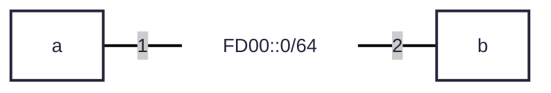
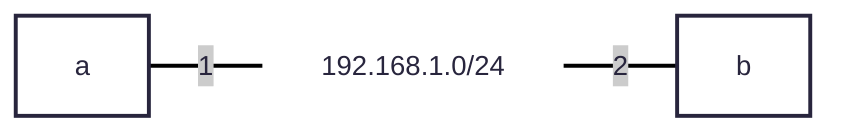

# openwrt 同士で wireguard を張ってみる

ルーターなどのマシーン同士で wireguard を張ってみます。

# 🎵 本日の一曲

<iframe width="312" height="176" src="https://ext.nicovideo.jp/thumb/sm44053987" scrolling="no" style="border:solid 1px #ccc;" frameborder="0"><a href="https://www.nicovideo.jp/watch/sm44053987">アブノーマル / 初音ミク</a></iframe>

お洒落なミクうたです。 落ち着いた曲です。

# バージョン情報

投稿日: 2025/07/31
openwrt: Snapshot
実験機器: fortigate 50e

> [!NOTE]
> 2025 年 7 月の snapshot では、パッケージマネージャーが opkg から apk に変更になってます。  
> この記事でもパッケージマネージャーは apk を使用します。

# パッケージインストール

```
# apk search wireguard
kmod-wireguard-6.6.80-r1
luci-proto-wireguard-25.192.00988~4715c6a
wireguard-tools-1.0.20250521-r1
```

- kmod: カーネルモジュール
- luci-: web ui 対応
- wireguard-tools: wireguard に必要なコマンドなど

この 3 つをインストール

# 構成について

今回は openwrt 機二つで、インターネット越しに vpn を張ってみようと思います。

## 通常のネットワーク(アンダーレイ)




## wireguard 内部からみたネットワーク(オーバーレイ)




# 鍵について

いわゆる ssl ってやつです。 ssh とほぼ同じ。  
Curve25519 となんか聞き馴染みのありそうな鍵アルゴリズムを使ってる[^wiki1]ようですが、ed25519 とは別物のそうです。[^wiki2]

# VPN を繋げてみる

gui でできます。

# 参考

## wikipedia

- [^wiki1]: [WireGuard](https://ja.wikipedia.org/wiki/WireGuard)
- [^wiki2]: [Curve25519](https://ja.wikipedia.org/wiki/Curve25519)
