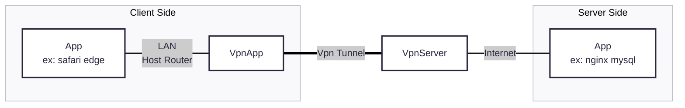

# Tailscale を使ってみた

便利の一言。

> [!WARNING]
> この記事ではインストール方法、具体的な使用方法を記載していません！！

# Tailscale ってなんや？

いわゆる VPN ってやつです。

原理はともかく、**トンネル**と呼ばれる**仮想専用線**で、ある部分(上の図だと「VpnServer」)まで直接データをやりとりするやつです。  
トンネルにはオプションで**暗号化**を施すことができ、上の図だと「VpnApp」から「VpnServer」の間まで暗号化されます。

> [!NOTE]  
> Tailscale などの最新 VPN は標準で暗号化され、無効化できません。

## VPN のメリット

- 専用線より安い  
  そもそも専用線とは、自社や NTT のダークファイバーなどを用いて、拠点間を直接結ぶものが一つ挙げられます。  
  外部と接しないために**セキュリティーが高い**というメリットがあります。[^暗号化1]  
  しかし、**維持費が高い**。  
  VPN は暗号化処理を施すことで、**専用線同等のセキュリティを確保できます**。
- 内部ネットワークを繋げられる  
  専用線のメリットではありますが、**内部専用のネットワークを繋げられます**。  
  通常の通信の場合は、サーバーごとに**グローバル IP アドレスの取得が不可避**ですが、内部ネットワークであれば**プライベート IP アドレス**で通信することができます。

> [!WARNING]  
> VPN のセキュリティは、暗号化処理によって変わります。  
> 日記さんは、SSH や HTTPS で使われる OpenSSL を用いる**wireguard、openvpn**などは安全だとよく耳にします。

> [!TIP]  
> プライベート IP の枯渇という別の問題は一旦目を逸らすこととする

## VPN のデメリット

- 侵入経路の糸口に繋がる  
  これが**非常に厄介**。内部ネットワークは**信頼のもと成り立つことが多いので、**一度侵入されると回復が非常に困難です。  
  侵入経路は簡単に、2 パターンあります
  - 認証基盤が脆い  
    VPN には暗号化に加えて**ユーザー認証があります。** ログイン処理。  
    このおかげで **内部と直接つながる VPN への侵入を防げるのですが、** 脆いと侵入されるのは簡単に想像できますよね。
  - **外からきたひとが勝手に VPN を使い、そこから侵入**  
    内部ネットワークへつながるトンネルを勝手に作ることになるので、VPN の使用を禁じる組織は多いそうです。
- トラブルが連鎖する  
  専用線同様のリスクとして、**一つの拠点が陥落すると、複数の拠点が同時に陥落する**という問題があります。  
  内部ネットワークを繋げるというのは、拠点を繋げることと同じで、守るべき部分が増えてしまいます。
- ラグくなる  
  通信暗号化処理を挟むので、通信速度が落ちます。ping 悪化します。

> [!NOTE]  
> **VPN の使用を禁じるのは難しい。**
>
> 最近の VPN だと、**HTTPS などと同様な通信にしか見えない**という特性を持ちます。[^参考1]
> これは、**OpenSSL が IP とポート番号を除いたほどんどの情報を暗号化してしまうから**です。(OSI レイヤーだと L5 以降。 **IPSec なら L3 以降、つまりポートも隠れる**)
>
> 結果的に VPN の通信をブロックすることが難しいです。 もはや利用者の良心に頼るしかない

# Tailscale の凄さ

Tailscale は色々と強いです。

- NAT 問題を回避できる
  プライベート IP アドレスは NAT によって変換されてしまうため、**外部から直接通信ができない**です。  
  Tailscale は、**ゲーム機などで用いられてる技術を VPN に応用し、このトラブルに対処します**。[^参考2]
- (ほとんどの場合は)P2P で通信できる  
  クライアント間で VPN を繋ぐことができます。 サーバーよりも物理的距離が縮まり、早くなるケースがあります。[^補足2]
- 必要な通信のみを VPN に通すことができる  
  個人的にはこれが熱い。 対外部通信は外部へ、対内部通信は VPN を通すと言ったことができます。

## 設定例とか

- 内部 DNS を設定する  
  PC の名前を変えれば ok。

  - [windows](https://pc-karuma.net/how-to-change-your-computer-name-in-windows-11/)
  - macOS/IOS/iPadOS 等: 設定/一般/情報/名前 で変更可能
  - Linux など: /etc/hostname などで変更可能

  例えば、adwpc と名付ければ、同じ tailscale に所属するもの同士、adwpc とアドレスを入力すれば通信できます。

- exitnode を設定する  
  一般的な VPN と同じように動作するものです。

  - 使われる側  
    `tailscale set --advertise-exit-node=true`  
    `tailscale up --advertise-exit-node=true`  
    ただし、linux では`net.ipv4.ip_forward`を[有効化](https://note.com/minato_kame/n/n8002de5a9b03)しないとダメらしい  
    [admin console](https://login.tailscale.com/admin/machines)で exitnode の有効化も必要[^参考3]
  - 使う側  
    windows や mac、iOS などでは**ExitNode を選択可能**。選択できるのは使われる側の設定を全て行った時

- 特定 IP の広告  
  tailscale は標準では**内部ネットワーク(LAN)を晒さない**。晒すのはあくまで自分の端末のみ。  
  IP を晒したいなら、`--advertise-routes xxx.xxx.xxx.xxx/nn`と設定すれば、晒せる。

> [!NOTE]  
> Firewall の設定は、大抵の場合自動で行ってくれます。

## tailscale あるある

あるあるネタです。

- プライベート IP アドレスが使えない!!  
  大抵は`--accept-routes, --exit-node`が true の時です。
  これは上記 exitnode と、特定 IP の広告を受け入れてる時です。  
  IP が被ったりして、通信ができなくなることがあります。

- 通信ができない!!
  tailscale の ACL 関係の問題や、**ライセンス的な問題**のことが多いと思います。  
  後者ですが、tailscale は課金ありなので、[ライセンスも確認](https://tailscale.com/pricing?plan=personal)してください。

# 終わり

便利だね。

# 参考・補足

## 参考

[^参考1]: [けしからん SoftEther VPN を作ったら怒られた　登大遊氏の VPN 構築ソフトを日本政府が配布停止した理由](https://logmi.jp/main/technology/323813)
[^参考2]: [How NAT traversal works](https://tailscale.com/blog/how-nat-traversal-works)
[^参考3]: [Exit nodes (route all traffic)](https://tailscale.com/kb/1103/exit-nodes)

## 補足

[^暗号化1]: ここでのセキュリティとは、**盗聴リスクの低減、外部からの侵入によるウイルス注入、情報漏洩など**
[^補足2]: 主に NGN 網内折り返しの通信の場合。 nuro であっても、**nuro 使用者同士であれば**早くなる模様。

## ご意見募集中

[当サイトのリポジトリ](https://github.com/tam1192/notepad.md/issues)にて、issue 募集中です!

- 投稿には github アカウントが必要です。
- テンプレート用意してます。 ぜひ活用してください。
  - [感想用テンプレート](https://github.com/tam1192/tam1192/issues/new?template=感想-コメント.md)
  - [誤解を招く内容への指摘](https://github.com/tam1192/tam1192/issues/new?template=誤解を招く内容への指摘.md)
