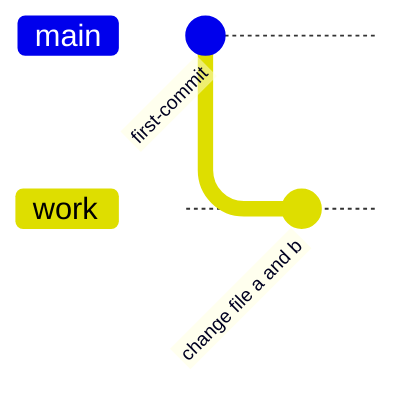
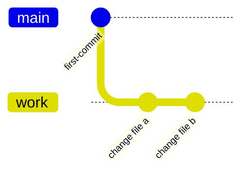
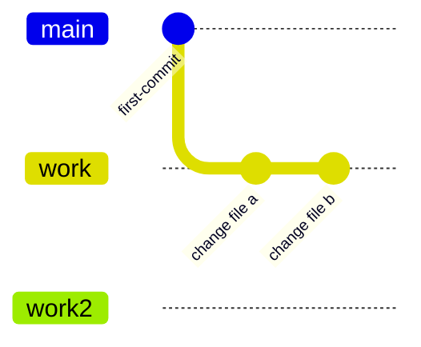
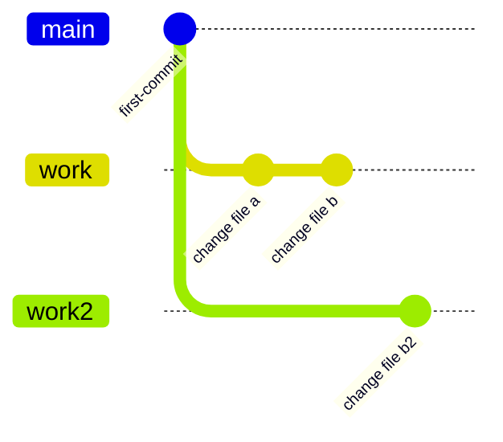
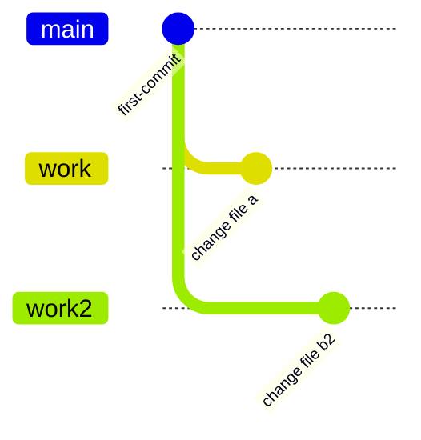

# git で誕生日をずらしてもらう方法

クリスマスに誕生日が被ると、プレゼントが一つになるそうです。

# 🎵 本日の一曲

<iframe width="312" height="176" src="https://ext.nicovideo.jp/thumb/sm42573036" scrolling="no" style="border:solid 1px #ccc;" frameborder="0"><a href="https://www.nicovideo.jp/watch/sm42573036">ワンルーム・ユニバース / 足立レイ</a></iframe>

音無あふさんと足立さんがより一層好きになった一曲  
かわいい

# やりたいこと

メインブランチ main と、作業中ブランチ work があり、work にてファイル A,B を新規作成している状態と仮定する。  
work を main に marge する時、ファイル B の内容がブランチの趣旨とあまりにも差が開いているため、新たなブランチ work2 とし、marge することにした。



> [!TIP]
> この図を元に説明します。  
> 説明のため、コミットメッセージをコミット id の代わりとして利用しています。

> [!WARNING]
> この記事では、~~日記さん基本ぼっちだから~~積極的に`git push -f`をします。  
> しかし、本来これは注意すべきコマンドです。 もし共同作業をしている場合はメンバーと調整しながらやるべきです。

> [!WARNING]
> コピペはやめなさい。 コピペする前提でこの記事は書かれていません。  
> ちなみにクソ眠い中書いています。

# rebase&reset をする

`rebase -i <commit_id>` で rebase をかける。

A,B が同じコミット`change file a and b` で編集されていた。 これを切り離したい。

```bash
rebase -i first-commit
```

## reset する

コミットが確定された状態になってるので、reset でステージング前に戻す。
vscode の gui 上で作業していたが、操作はコマンドラインのほうが安全だと思った。

> [!TIP]
> reset、rebase 時に指定するコミット id は**一つ手前のコミットで**

## stash を活用してみる

初めて使ってみた。 `git stash pop`というコマンドがあることから、スタックみたいな動作をしてるように感じた。  
ステージング(`git add .`)して、スタッシュ(`git stash add`)とすると、ステージングされていた全てのファイルが一度消える。  
`git stash apply`でファイルを戻すことができる。この状態でファイル b を削除し、通常通りの手順でコミットを行う。  
その後、`git stash pop`でファイル b を復元する。

> [!TIP] > `git stash add`の後ろに**引数は不要**

> [!NOTE] > `pop`だとスタッシュから**消えてしまう**が、`apply`だとスタッシュに**残り続ける**らしい。

この手順を取った背景として、mdbook を使っており、`SUMMARY.md`の内容をファイルの存在に合わせて変更をかけたかったから。

> [!TIP]
> つまり、ファイルを編集するようなことはなく、ステージング有無で調整できるなら**stash は不要**



# ブランチを新規作成

`main`ブランチに移動して、
`git checkout -b work2` でブランチを作成します。

> [!TIP]
> あるコミットから分岐したい場合は`git checkout -b work2 <分岐する手前のcommit_id>`で可能です。



# cherry-pick してみる

`change file b`を`work2`に移動するために、cherry-pick を使用します。  
`work2`ブランチに移動して、`git cherry-pick change file b`でコミットを持ってこれます。



# work ブランチから change file b コミットを削除する

`git reset --hard change file b`でコミットを削除しましょう。



# 終わり

おわり
