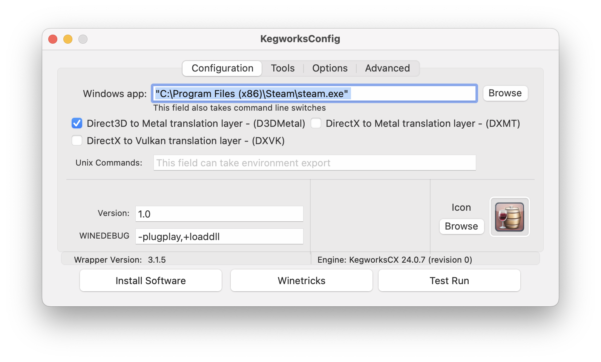
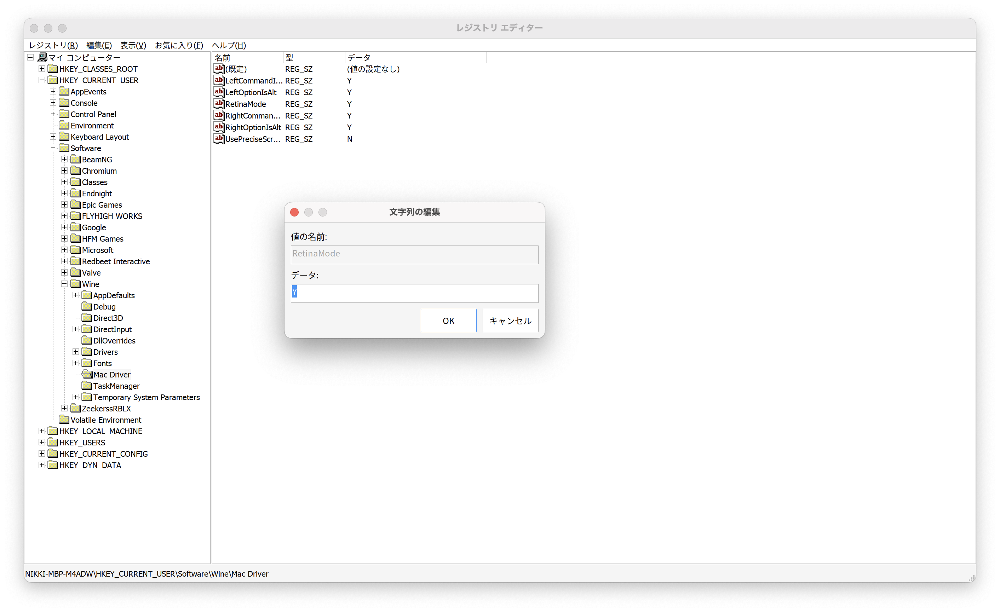
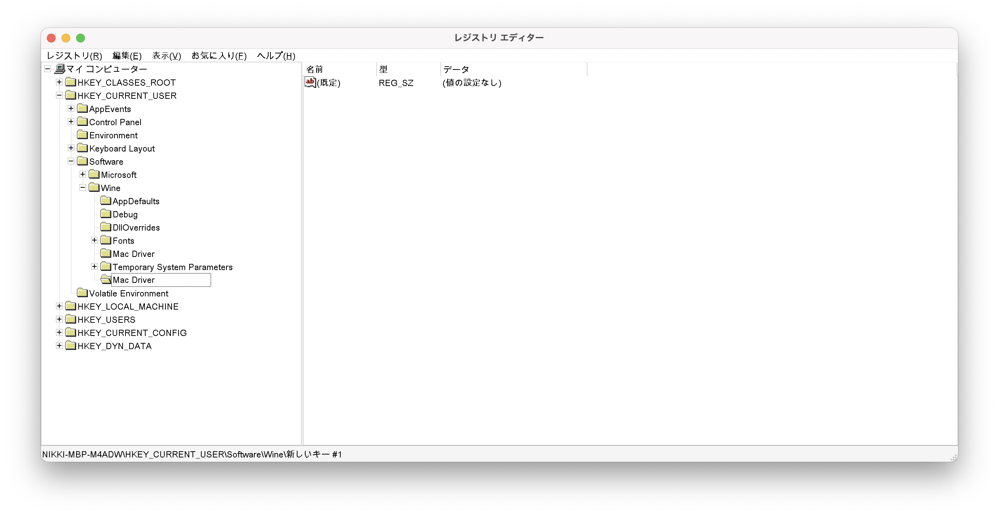
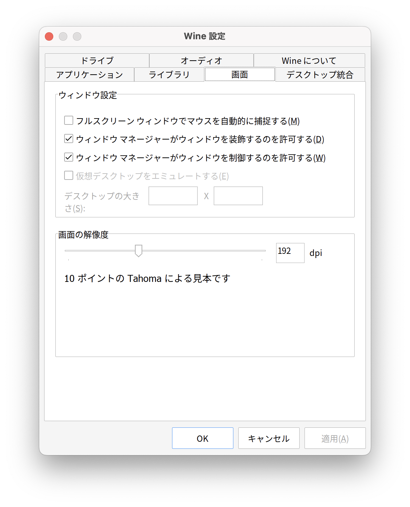
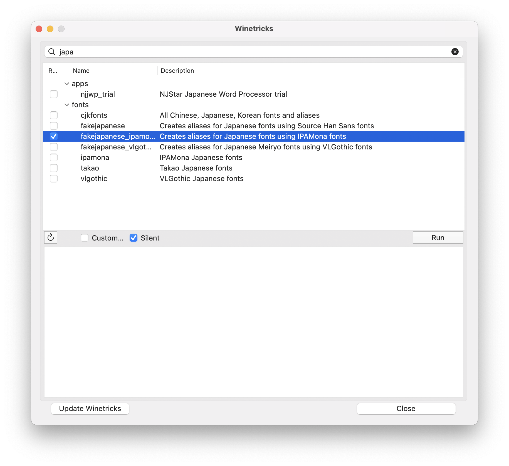

# mac の wine と、retina や d3d11 とかの話

iPhone でゲームができるなら、Mac でもゲームができるんですねぇ。

> [!WARNING]  
> この記事では、wine 関係の**情報**と、**RetinaMode 有効化**について書いております。  
> **wine 導入**の話は暇だったら別記事で後日書きます。

# なぜ mac でゲームをするか

理由はない。浪漫だ。  
~~決して mac 切り替えと同時に windows 機の寿命が切れたわけではない~~

## 真面目な理由

ゲーム機を専用で用意するほどゲームをやるわけではないです。
しかし、forest とか raft とか、ああいった遭難系サバイバルゲームはやると面白いので、たまにやりたくなったわけです。

ゲーム機は steam にある~~バカゲー~~いわゆるインディーゲーとかがあまりないですし、  
(そもそも〇〇オンラインとかが高そう)
コーディングとか普段使いは mac の方がいいですし。

**何より windows ゲーを windows 以外の OS で動作させてみたい**という癖があるので、  
こんなことしてます。

# wine

windows アプリケーションを windows 以外の OS で動作させるには二通りの手段が思い付きます。

- 仮想化  
  バーチャルマシンとかいうやつ。  
  gpu 資源の共有が簡単にはできないので、どうしても仮想マシン側のグラフィック処理が劣る。(つまり重い)  
  そもそも OS が二つ動くから、メモリ二倍必要。  
  ただし、純粋な windows が動くため、トラブルが少ない。
- wine  
  変換レイヤーというやつ。仮想化ではない。  
  windows のアプリケーション、をあたかも unix(linux)アプリケーションとして動かすことができてしまう。  
  OS 側から見れば、純粋な unix(linux)アプリケーションなので、gpu 資源などの共有が簡単。(**できるとは言ってない**)

仮想化は、IOMMU やら SR-IOV などの発展によって gpu の資源問題は解決に近づいているらしい。  
しかし、仮想マシンはどっちにしろ重い。wine は変換レイヤーに処理コストが多少かかるが、それでもマシ。  
問題は**DirectX**

## DirectX

グラフィック API の一つ。 **windows 専用**  
linux だと OpenGL/Vulkan、Darwin(MacOS,IOS,IPadOS など) だと Metal。

これらの変換レイヤーが近年になって登場している。  
proton: DirectX -> Vulkan
GPTK: DirectX -> Metal

# mac には proton がない

登場しないかな。  
上記の通り、proton は wine に加え、DirectX を Vulkan に変換するレイヤー**DXVK**を持っています。  
互換性も向上している模様[^pcw1]

そのため、スムーズにゲームができると想像できます。(私はやったことない)

**mac 非対応**
対応してると思ってたんだよね。unix(darwin) だし。  
linux と darwin は側が似てるだけで**中身全然異なるんだよね**

# GPTK: Game Porting Toolkit

[Apple が公式で提供している GPTK](https://developer.apple.com/jp/games/game-porting-toolkit/)。

> Apple シリコン上で Windows 実行可能ファイルを評価する

> シェーダコードを Metal に変換する

と公式ページに書かれている通り、windows ゲームを変換する方法を提供してくれております。

この中に**D3DMetal**が含まれているそうです。

> [!NOTE]
> おそらくゲーム開発者向けの kit  
> MacOS 向けの開発をスムーズに始められるように

## D3DMetal と wine の統合

これらを統合したアプリケーションは、確認した中で複数存在しました。  
特に、[**Kegworks**](https://github.com/Kegworks-App/Kegworks)は、さまざまな wine のバージョンを試せるため、おすすめ。  
[corssover](https://www.codeweavers.com) という選択肢もあるけれど、普通に高い。

> [!TIP]  
> [DXMT](https://github.com/3Shain/dxmt)は D3DMetal と異なり、オープンソースで似たようなことを行うプロジェクト

## Retina に対応させる。

せっかく綺麗なディスプレイを搭載してるので(Macbook 系は)、  
Retina にも対応させましょう。

wine 付属の regedit で  
`HKEY_CURRENT_USER\Software\Wine\Mac Driver`  
この中に、文字列値を追加

値の名前:  
`RetinaMode`  
データ:  
`Y`

> [!TIP]  
> なければキーを追加してくだされ  
> 

これで wine を再起動すると、Retina 対応になります。(解像度が mac のディスプレイと同じになる)  
**wine 設定(winecfg)の画面設定から DPI を上げておくことを推奨します。**

> [!TIP]  
> 日本語化する際のフォントですが、fakejapanese 系のやつが結構豆腐を消してくれるイメージがあります。  
> 

# 参考

[^pcw1]: [Linux で Windows ゲームが楽しめる「Proton」が互換性向上&バグ修正多数を実施](https://pc.watch.impress.co.jp/docs/news/2011601.html)
