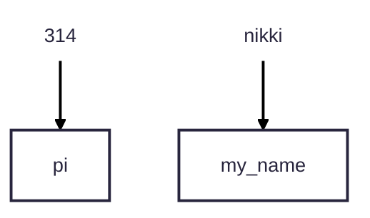
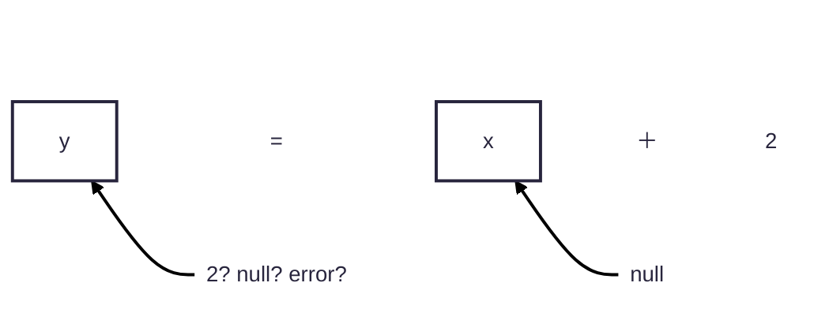

# ライフタイムを意識してコードを書く、その 1.rs

今回のお題はこのコードです。

```rust
# use std::{sync::{Arc, Mutex}, thread, time::Duration};
#
# fn main() {
    // スレッド間で安全に使えるようにする
    let counter = Arc::new(Mutex::new(0));
    // スレッドを建てる
    let threads = (0..2).map(|_| {
        let counter = counter.clone();
        let handle = thread::spawn(move || {
            for _ in 0..5 {
                // 10msごとに実行する
                thread::sleep(Duration::from_millis(10));
                let mut counter = counter.lock().unwrap();
                *counter += 1;
            }
        });
        // 5ms秒ごとにスレッドを建てる
        thread::sleep(Duration::from_millis(5));
        handle
    }).collect::<Vec<_>>();

    // すべてのスレッドを待つ
    for thread in threads {
        thread.join();
    }

    // 実行結果を表示
    println!("{}", *counter.lock().unwrap());
# }
```

特に問題なく、コードは実行されます。

## とりあえずコード解説を

前提知識を少しだけ説明します。

### 所有権&参照

一般的に、数値や文字列と行った **「値」** は、変数と呼ばれる **「文字」** に関連づけられます。  
入門書では、よく箱にたとえられます。



この箱は、~~近年 32GB でも足りないと騒がれている~~**メモリに保管されます**

**ところで、ルールを決めないで変数を扱うとどうなるでしょうか？**
次のことが考えられます

1. 想定していた値と、異なるタイプだったりする
   ```mermaid
   ---
   config:
   theme: redux
   ---
   flowchart RL
       n8[" "] ~~~ n1
       n7[" "] ~~~ n2["x"]
       n4["="] ~~~ n1["y"]
       n2 ~~~ n4
       n5["＋"] ~~~ n2
       n3["2"] ~~~ n5
       n6["Hello world"] --> n2
       n9["2Hello world? error?"] --> n1
       n7@{ shape: text}
       n2@{ shape: rect}
       n4@{ shape: text}
       n1@{ shape: rect}
       n5@{ shape: text}
       n3@{ shape: text}
       n6@{ shape: text}
       n8@{ shape: text}
       n9@{ shape: text}
       style n7 color:none
   ```
2. 値が**まだない可能性すらある**



3. 他のスレッドからポインタなどで値が意図せず書き換えられる
4. **削除するルールが存在しないため、場合によっては永遠にメモリに値が蓄積される**
5. 値が**誰かによって削除される可能性すらある**

これは恐ろしいことです。

そのため、1 と 2 は**型システムと null 安全性によって保護されています。**
特に、null 安全性は言い換えれば**一度束縛した変数を null で削除することはできないことを保証してくれます。**

```rust
#fn main() {
let x = null;
#}
```

3 は**基本が不変であることが解決します。** `mut`キーワードをつけない変数は不変であり、値が変わることがありません。

```rust
# fn main() {
let x = 3;
x = 10;
#}
```

代わりに、**シャドーイングが許可されてます。** これは、一度変数に使った文字を**別の変数としてもう一度束縛使えることです。**  
それぞれ別の変数となるため、型が変わっていても 問題ありません。

```rust
# fn main() {
let x = 3;
let x = x + 2; // 手前のxと、このxの値は別物
#}
```

4,5 は**所有権が解決します。**  
所有権とは値の所有権を指します。 その値を束縛できる変数が一つであることを示します。  
言い換えればこれは、ポインタや参照を安易に作れないことを意味します。  
所有権は**スコープ内で有効です**。 スコープを外れた場合は **4 を解決するために値は削除されます。**

また、rust の変数は`Copy`トレイトが実施されている`i32`などを除き move です。
move とは、所有権の移動です。 比較的簡単に move ができます。

```rust, editable
fn main() {
    let x = "hello world"; // 所有権発動
    {
        // スコープの中にxが移る (move)
        let x = x;
        println!("{}", x);
        // xと、その値はここで削除される
    }
    // ↓コメントアウト解除してみてね
    // println!("{}", x);
}
```

参照を使えばそれを解決できます。 move を行わないです。

```rust
# fn main() {
    let x = "hello world"; // 所有権発動
    {
        // スコープの中にxが移る (move)
        let x = &x;
        println!("{}", x);
        // xと、その値はここで削除される
    }
    // ↓コメントアウト解除してみてね
    println!("{}", x);
# }
```

参照の注意として、**所有者が消えたら参照も無効になること**です。所有者より参照の生存時間 **(ライフタイム)** が長ければ **コンパイル時エラーが発生します。**
コンパイル時エラー、つまりコンパイルできないということです。

### Arc

これは参照カウンタと呼ばれるものです。Rc というのもありますが、こちらはスレッドセーフであることが異なります。マルチスレッドで動かすので、今回はこちらを使います。

参照カウンタとは、通常の参照と異なり、**参照のライフタイムで値のライフタイムを決める**仕組みです。 通常のライフタイムは所有者のライフタイムで決まるのでその点違います。

シングルスレッドと異なり、**並行的に処理が動作するマルチスレッドでは、スレッド間で共有する変数のライフタイムの計算ができません。**
シングルスレッドは上から下へ、ループや関数でソースコードを飛ぶことはあれど**基本は上から順番に実行されます。 追い抜かすことはありません。**

```rust
# fn main() {
let x = 1;
assert!(x==1);
let x = x + 1;
assert!(x==2);
let x = x / 2;
assert!(x==1);
let mut x = x * 5;
assert!(x==5);
for _ in 0..5 {
    x = x - 1;
}
assert!(x==0);
#}
```

一方、**マルチスレッドはこれを追い越す可能性があるのです**。 つまり、1,2,3 という順番でプログラミングしていたのが、
実際は 1,3,2 の順で処理が進むなんてことがあるのです。

ライフタイムが計算できないとは、こういうことがあり所有権のライフタイムをコンパイル時に決定できないということなのです。

### Mutex

Mutex は、変数の独占権を得られるものです。 Mutex を採用する変数では、ロックされている場合は**処理がブロッキング**されます。
Mutex は、**所有権のライフタイム分変数をロックしてくれます。**

```rust
# use std::{sync::{Arc, Mutex}, thread, time::Duration};
# fn main(){
let x = Arc::new(Mutex::new("helloworld"));
// スレッドを建てる
{
    let x = x.clone();
    thread::spawn(move || {
        // 0.5秒lockしておく
        let x = x.lock().unwrap();
        thread::sleep(Duration::from_millis(2000));
    });
}
// lockが取得できるまで待たされる。
println!("{}", x.lock().unwrap());
# }
```

多分実行したら 2 秒ほど奪われると思います。

このおかげで、**3. 他のスレッドからポインタなどで値が意図せず書き換えられる**を **解決できます**

# 一つの災

とりあえず何故かクソ丁寧に rust の前提知識を説明しましたが、足りなかったらぜひ[The Rust Programming Language](https://doc.rust-jp.rs/book-ja/)をお読みください。

さて、この項目では最初に出したコードにある落とし穴の説明をします。

```rust
# use std::{sync::{Arc, Mutex}, thread, time::Duration};
#
# fn main() {
    // スレッド間で安全に使えるようにする
    let counter = Arc::new(Mutex::new(0));
    // スレッドを建てる
    let threads = (0..2).map(|_| {
        let counter = counter.clone();
        let handle = thread::spawn(move || {
            for _ in 0..5 {
                // 10msごとに実行する
                let mut counter = counter.lock().unwrap();
                thread::sleep(Duration::from_millis(10));
                *counter += 1;
            }
        });
        // 5ms秒ごとにスレッドを建てる
        thread::sleep(Duration::from_millis(5));
        handle
    }).collect::<Vec<_>>();

    // すべてのスレッドを待つ
    for thread in threads {
        thread.join();
    }

    // 実行結果を表示
    println!("{}", *counter.lock().unwrap());
# }
```

2 行ほどコードが変わりました。 どこが変わったら考えてみてください。  
また、これにより実行時間が変わってます。 計測してみましょう。

### 最初にあげたコードの場合

とりあえず計測方法は雑です。 差があれば説明が付くので。
あと実行環境によって日記さんの想定とは結果が異なる可能性もありますので、後で結論も書きます。

なお、先ほどまでのコードは`func()`に収めてます。

```rust
# use std::{sync::{Arc, Mutex}, thread, time::{Duration, SystemTime}};
#
# fn main() {
let now = SystemTime::now();
func();
println!("time: {}", now.elapsed().unwrap().as_millis());

# }
fn func() {
    // スレッド間で安全に使えるようにする
    let counter = Arc::new(Mutex::new(0));
    // .....
    // スレッドを建てる
    let threads = (0..2).map(|_| {
        let counter = counter.clone();
        let handle = thread::spawn(move || {
            for _ in 0..5 {
                // 10msごとに実行する
                thread::sleep(Duration::from_millis(10));
                let mut counter = counter.lock().unwrap();
                *counter += 1;
            }
        });
        // 5ms秒ごとにスレッドを建てる
        thread::sleep(Duration::from_millis(5));
        handle
    }).collect::<Vec<_>>();

    // すべてのスレッドを待つ
    for thread in threads {
        thread.join();
    }

    // 実行結果を表示
    println!("{}", *counter.lock().unwrap());
}
```

### 一つの災のコード

```rust
# use std::{sync::{Arc, Mutex}, thread, time::{Duration, SystemTime}};
#
# fn main() {
let now = SystemTime::now();
func();
println!("time: {}", now.elapsed().unwrap().as_millis());

# }
fn func() {
    // スレッド間で安全に使えるようにする
    let counter = Arc::new(Mutex::new(0));
    // .....
    // スレッドを建てる
    let threads = (0..2).map(|_| {
        let counter = counter.clone();
        let handle = thread::spawn(move || {
            for _ in 0..5 {
                let mut counter = counter.lock().unwrap();
                // 10msごとに実行する
                thread::sleep(Duration::from_millis(10));
                *counter += 1;
            }
        });
        // 5ms秒ごとにスレッドを建てる
        thread::sleep(Duration::from_millis(5));
        handle
    }).collect::<Vec<_>>();

    // すべてのスレッドを待つ
    for thread in threads {
        thread.join();
    }

    // 実行結果を表示
    println!("{}", *counter.lock().unwrap());
}
```

### 結果

time が前者のコードは 55、後者のコードは 100 となりました。  
もう一度書きますが、環境によっては差があるかもしれません。

何故このようなことが起きるのでしょうか？

そもそもどこが異なっていたのでしょうか？ その答えは...

```diff
    // スレッド間で安全に使えるようにする
    let counter = Arc::new(Mutex::new(0));
    // .....
    // スレッドを建てる
    let threads = (0..2).map(|_| {
        let counter = counter.clone();
        let handle = thread::spawn(move || {
            for _ in 0..5 {
+                let mut counter = counter.lock().unwrap();
                // 10msごとに実行する
                thread::sleep(Duration::from_millis(10));
-                let mut counter = counter.lock().unwrap();
                *counter += 1;
            }
        });
        // 5ms秒ごとにスレッドを建てる
        thread::sleep(Duration::from_millis(5));
        handle
    }).collect::<Vec<_>>();

    // すべてのスレッドを待つ
    for thread in threads {
        thread.join();
    }

    // 実行結果を表示
    println!("{}", *counter.lock().unwrap());
```

たったこれだけです。 lock する時間に 10ms という空白も含まれてしまっていたのです。

### これだけだとまだ簡単だけど...

周辺のコードだけを抜粋しました。

```rust
# use std::{sync::{Arc, Mutex}, thread, time::{Duration, SystemTime}};
#
#fn main() {
# let now = SystemTime::now();
#    // スレッド間で安全に使えるようにする
#    let counter = Arc::new(Mutex::new(0));
#    // .....
#    // スレッドを建てる
#    let threads = (0..2).map(|_| {
#        let counter = counter.clone();
#        let handle = thread::spawn(move || {
            for _ in 0..5 {
                let mut counter = counter.lock().unwrap();
                // 10msごとに実行する
                thread::sleep(Duration::from_millis(10));
                *counter += 1;
            }
#        });
#        // 5ms秒ごとにスレッドを建てる
#        thread::sleep(Duration::from_millis(5));
#        handle
#    }).collect::<Vec<_>>();
#
#    // すべてのスレッドを待つ
#    for thread in threads {
#        thread.join();
#    }
#
#    // 実行結果を表示
#    println!("{}", *counter.lock().unwrap());
# println!("time: {}", now.elapsed().unwrap().as_millis());
#}
```

ちょっと改善してみました。

```rust
# use std::{sync::{Arc, Mutex}, thread, time::{Duration, SystemTime}};
#
#fn main() {
# let now = SystemTime::now();
#    // スレッド間で安全に使えるようにする
#    let counter = Arc::new(Mutex::new(0));
#    // .....
#    // スレッドを建てる
#    let threads = (0..2).map(|_| {
#        let counter = counter.clone();
#        let handle = thread::spawn(move || {
            for _ in 0..5 {
                let mut counter = counter.lock().unwrap();
                *counter += 1;
                // 10msごとに実行する
                thread::sleep(Duration::from_millis(10));
            }
#        });
#        // 5ms秒ごとにスレッドを建てる
#        thread::sleep(Duration::from_millis(5));
#        handle
#    }).collect::<Vec<_>>();
#
#    // すべてのスレッドを待つ
#    for thread in threads {
#        thread.join();
#    }
#
#    // 実行結果を表示
#    println!("{}", *counter.lock().unwrap());
# println!("time: {}", now.elapsed().unwrap().as_millis());
#}
```

うーん結果は 100 ミリ秒か。 変わんないな。 それもそうです。
このコードではライフタイムを考慮する必要があります。 lock は所有権のライフタイムと一致しており  
**所有権が切れるのはスコープを抜けるまで**です

```rust
# use std::{sync::{Arc, Mutex}, thread, time::{Duration, SystemTime}};
#
#fn main() {
# let now = SystemTime::now();
#    // スレッド間で安全に使えるようにする
#    let counter = Arc::new(Mutex::new(0));
#    // .....
#    // スレッドを建てる
#    let threads = (0..2).map(|_| {
#        let counter = counter.clone();
#        let handle = thread::spawn(move || {
            for _ in 0..5 {
                {
                    let mut counter = counter.lock().unwrap();
                    *counter += 1;
                }
                // 10msごとに実行する
                thread::sleep(Duration::from_millis(10));
            }
#        });
#        // 5ms秒ごとにスレッドを建てる
#        thread::sleep(Duration::from_millis(5));
#        handle
#    }).collect::<Vec<_>>();
#
#    // すべてのスレッドを待つ
#    for thread in threads {
#        thread.join();
#    }
#
#    // 実行結果を表示
#    println!("{}", *counter.lock().unwrap());
# println!("time: {}", now.elapsed().unwrap().as_millis());
#}
```

お、このコードの結果は 55 秒です。  
スコープを分けたので、sleep 前に lock の所有権が切れてしまうからです。

# 結論

スコープというのは、コンパイルエラーを防ぐだけでなく  
**実行時間にも影響してしまうことを**覚えておきましょう。

ひとくちメモとは。
